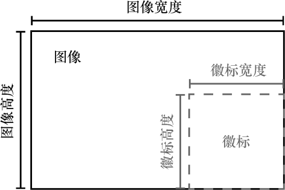
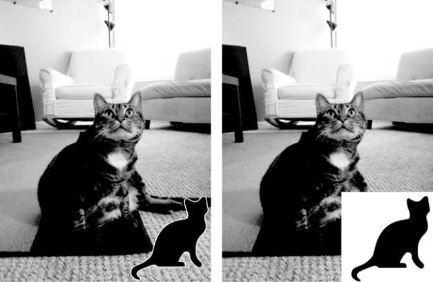

### 第4步：添加徽标，并保存更改

不论图像是否调整大小，徽标都应粘贴到图像右下角。徽标粘贴的确切位置取决于图像的大小和徽标的大小。图19-12展示了如何计算粘贴的位置。粘贴徽标的左坐标将是图像宽度减去徽标宽度，顶坐标将是图像高度减去徽标高度。


<center class="my_markdown"><b class="my_markdown">图19-12　在右下角放置徽标，左坐标和顶坐标应该是图像宽度/高度减去徽标宽度/高度</b></center>

用代码将徽标粘贴到图像中后，应保存修改后的 `Image` 对象。将以下代码添加到程序中：

```javascript
#! python3
# resizeAndAddLogo.py - Resizes all images in current working directory to fit
# in a 300x300 square, and adds catlogo.png to the lower-right corner.
import os
from PIL import Image
--snip--
   # Check if image needs to be resized.
   --snip--
   # Add the logo.
❶ print('Adding logo to %s...' % (filename))
❷ im.paste(logoIm, (width - logoWidth, height - logoHeight), logoIm)
   # Save changes.
❸ im.save(os.path.join('withLogo', filename))
```

新的代码输出一条消息，告诉用户徽标已被加入❶，将 `logoIm` 粘贴到 `im` 中计算的坐标处❷，并将变更保存到withLogo目录的 `filename` 中❸。如果运行这个程序，zophie.png文件是工作目录中唯一的图像，输出结果会是这样：

```javascript
Resizing zophie.png...
Adding logo to zophie.png...
```

图像zophie.png将变成225像素×300像素的图像，如图19-13所示。请记住，如果没有传入 `logoIm` 作为第三个参数，那么 `paste()` 方法不会粘贴透明的像素。这个程序可以在短短几分钟内自动调整几百幅图像，并“加上徽标”。


<center class="my_markdown"><b class="my_markdown">图19-13　图像zophie.png调整了大小并加上了徽标（左）。如果忘记了第三个参数，徽标中透明的像素将被复制为不透明的白色像素（右）</b></center>

