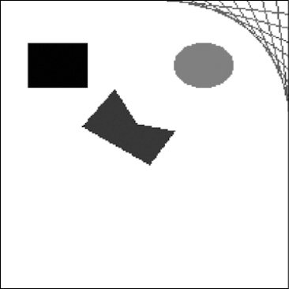

### 19.4.1　绘制形状

下面的 `ImageDraw` 模块的方法可在图像上绘制各种形状。这些方法的 `fill` 和 `outline` 参数是可选的，如果未指定，默认均为白色。

#### 点

`point(xy, fill)` 方法绘制单个像素。 `xy` 参数表示要画的点的列表。该列表可以是x和y坐标的元组的列表，例如 `[(x, y), (x, y), ...]` ；或是没有元组的x和y坐标的列表，例如 `[x1, y1, x2, y2, ...]` 。 `fill` 参数是点的颜色，要么是一个RGBA元组，要么是颜色名称的字符串，如 `'red'` 。 `fill` 参数是可选的。

#### 线

`line(xy, fill, width)` 方法绘制一条线或一系列的线。 `xy` 要么是一个元组的列表，例如 `[(x, y), (x, y), ...]` ，要么是一个整数列表，例如 `[x1, y1, x2, y2, ...]` 。每个点都是正在绘制的线上的一个连接点。可选的 `fill` 参数是线的颜色，是一个RGBA元组或颜色名称。可选的 `width` 参数是线的宽度，如果未指定，默认值为1。

#### 矩形

`rectangle(xy, fill, outline)` 方法绘制一个矩形。 `xy` 参数是一个矩形元组，形式为 `(left, top, right, bottom)` 。 `left` 和 `top` 值指定了矩形左上角的x和y坐标， `right` 和 `bottom` 指定了矩形的右下角的x和y坐标。可选的 `fill` 参数是颜色，将填充该矩形的内部。可选的 `outline` 参数是矩形轮廓的颜色。

#### 椭圆

`ellipse(xy, fill, outline)` 方法绘制一个椭圆。如果椭圆的长轴和短轴一样，该方法将绘制一个圆。 `xy` 参数是一个矩形元组 `(left, top, right, bottom)` ，它表示正好包含该椭圆的矩形。可选的 `fill` 参数是椭圆内的颜色，可选的 `outline` 参数是椭圆轮廓的颜色。

#### 多边形

`polygon(xy, fill, outline)` 方法绘制任意的多边形。 `xy` 参数是一个元组列表，例如 `[(x, y), (x, y), ...]` ；或者是一个整数列表，例如 `[x1, y1, x2, y2, ...]` ，表示多边形边的连接点。最后一对坐标将自动连接到第一对坐标。可选的 `fill` 参数是多边形内部的颜色，可选的 `outline` 参数是多边形轮廓的颜色。

#### 绘制示例

在交互式环境中输入以下代码：

```javascript
  >>> from PIL import Image, ImageDraw
  >>> im = Image.new('RGBA', (200, 200), 'white')
  >>> draw = ImageDraw.Draw(im)
❶ >>> draw.line([(0, 0), (199, 0), (199, 199), (0, 199), (0, 0)], fill='black')
❷ >>> draw.rectangle((20, 30, 60, 60), fill='blue')
❸ >>> draw.ellipse((120, 30, 160, 60), fill='red')
❹ >>> draw.polygon(((57, 87), (79, 62), (94, 85), (120, 90), (103, 113)),
   fill='brown')
❺ >>> for i in range(100, 200, 10):
              draw.line([(i, 0), (200, i - 100)], fill='green')
  >>> im.save('drawing.png')
```

为200像素×200像素的白色图像生成 `Image` 对象后，将它传入 `ImageDraw. Draw()` ，获得 `ImageDraw` 对象。将 `ImageDraw对象` 保存在 `draw` 中，可以对 `draw` 调用绘图方法。这里，我们在图像边缘画上窄的黑色轮廓❶；画一个蓝色的矩形，左上角在（20, 30），右下角在（60, 60）❷；画一个红色的椭圆，由（120, 30）到（160, 60）的矩形来定义❸；画一个棕色的多边形，有5个顶点❹，以及一些绿线的图案，用 `for` 循环绘制❺。得到的drawing.png文件如图19-14所示。


<center class="my_markdown"><b class="my_markdown">图19-14　得到的图像drawing.png</b></center>

`ImageDraw` 对象还有另外几个绘制形状的方法，读者可自行查询完整的技术文档。

