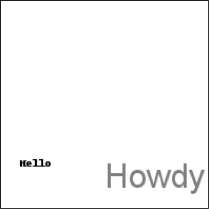

### 19.4.2　绘制文本

`ImageDraw` 对象还有 `text()` 方法，用于在图像上绘制文本。 `text()` 方法有4个参数： `xy` 、 `text` 、 `fill` 和 `font` 。

+ `xy` 参数是两个整数的元组，指定文本区域的左上角。
+ `text` 参数是想写入的文本字符串。
+ 可选参数 `fill` 是文本的颜色。
+ 可选参数 `font` 是一个 `ImageFont` 对象，用于设置文本的字体和大小。后续内容更详细地介绍了这个参数。

因为通常很难预先知道一块文本在给定的字体下的大小，所以 `ImageDraw` 模块也提供了 `textsize()` 方法。它的第一个参数是要测量的文本字符串，第二个参数是可选的 `ImageFont` 对象。 `textsize()` 方法返回一个两整数元组，表示在以指定的字体写入图像时文本的宽度和高度。可以利用这个宽度和高度，来精确计算文本放在图像上的位置。

`text()` 的前3个参数非常简单。在用 `text()` 向图像绘制文本之前，让我们来看看可选的第四个参数，即 `ImageFont` 对象。

`text()` 和 `textsize()` 都接收可选的 `ImageFont` 对象作为最后一个参数。要创建这种对象，先执行以下命令：

```javascript
>>> from PIL import ImageFont
```

既然已经导入 `pillow` 的 `ImageFont` 模块， 就可以调用 `ImageFont.truetype()` 函数，它有两个参数。第一个参数是字符串，表示字体的 `TrueType` 文件，这是硬盘上实际的字体文件。TrueType字体文件具有 `.ttf` 文件扩展名，通常可以在以下文件夹中找到。

+ 在Windows操作系统上：C:\Windows\Fonts。
+ 在macOS上：/Library/Fonts和/System/Library/Fonts。
+ 在Linux操作系统上：/usr/share/fonts/truetype。

实际上并不需要输入这些路径作为TrueType字体文件的字符串的一部分，因为Python会自动在这些目录中搜索字体。如果无法找到指定的字体，Python会显示错误。

`ImageFont.truetype()` 的第二个参数是一个整数，表示字体大小的点数（而不是像素）。请记住， `pillow` 创建的PNG图像默认是每英寸72像素，一点是1/72英寸。

在交互式环境中输入以下代码，用你的操作系统中实际的文件夹名称替换 `FONT_FOLDER` ：

```javascript
  >>> from PIL import Image, ImageDraw, ImageFont   
  >>> import os
❶ >>> im = Image.new('RGBA', (200, 200), 'white')
❷ >>> draw = ImageDraw.Draw(im)
❸ >>> draw.text((20, 150), 'Hello', fill='purple')
  >>> fontsFolder = 'FONT_FOLDER' # e.g. ‘/Library/Fonts’
❹ >>> arialFont = ImageFont.truetype(os.path.join(fontsFolder, 'arial.ttf'), 32)
❺ >>> draw.text((100, 150), 'Howdy', fill='gray', font=arialFont)
  >>> im.save('text.png')
```

导入 `Image` 、 `ImageDraw` 、 `ImageFont` 和 `os` 后，我们生成一个 `Image` 对象，它是新的200像素×200像素白色图像❶，并通过这个 `Image` 对象得到一个 `ImageDraw` 对象❷。我们使用 `text()` 在（20, 150）以紫色绘制 `Hello` ❸。在这次 `text()` 调用中，我们没有传入可选的第四个参数，因此这段文本的字体和大小没有定制。

要设置字体和大小，我们首先将文件夹名称（如/Library/Fonts）保存在 `fontsFolder` 中。然后调用 `ImageFont.truetype()` ，传入我们想要的字体的 `.ttf` 文件，之后是表示字体大小的整数❹。将 `ImageFont.truetype()` 返回的 `Font` 对象保存在 `arialFont` 这样的变量中，然后将该变量传入 `text()` ，作为最后的关键字参数。❺行的 `text()` 调用绘制了Howdy，采用灰色、32点Arial字体。

得到的text.png文件如图19-15所示。


<center class="my_markdown"><b class="my_markdown">图19-15　得到的图像text.png</b></center>

