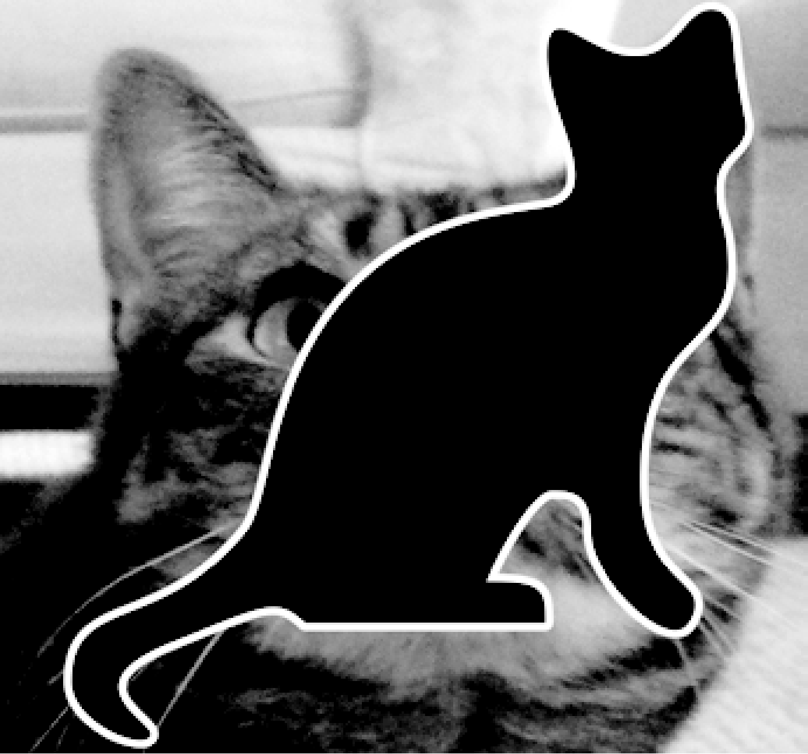

### 19.7.1　扩展和修正本章项目的程序

本章的resizeAndAddLogo.py程序使用PNG和JPEG文件，但 `pillow` 还支持许多格式，不仅仅是这两个。扩展resizeAndAddLogo.py，让它也能处理GIF和BMP图像。

另一个小问题是，只有文件扩展名为小写时，程序才修改PNG和JPEG文件。例如，它会处理zophie.png，但不处理zophie.PNG。修改代码，让文件扩展名检查不区分大小写。

最后，添加到右下角的徽标本来只是一个小标记，但如果该图像与徽标本身差不多大，结果将类似于图19-16。修改resizeAndAddLogo.py，使得图像的宽度和高度必须至少是徽标的两倍，然后才粘贴徽标；否则，它应该跳过添加徽标。

<b class="my_markdown">图19-16　如果图像不比徽标大很多，结果会很难看</b>

