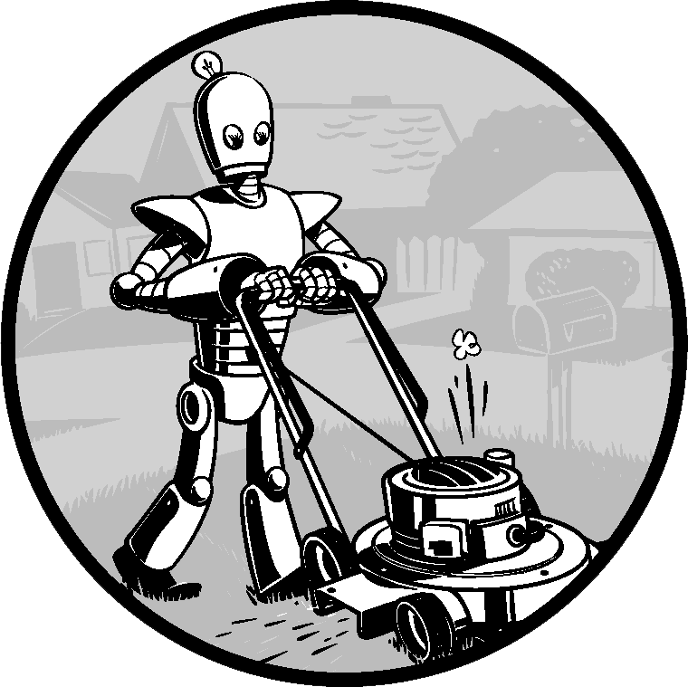
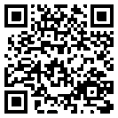

### 第1章　Python基础

Python编程语言有许多语法结构、标准库函数和交互式开发环境功能。好在你可以忽略大多数内容，只需要学习部分内容，就能编写一些方便的小程序。

但在动手之前，你必须学习一些基本编程概念。就像魔法师培训，你可能认为这些概念既深奥又啰唆，但有了一些知识和实践，你就能像魔法师一样指挥你的计算机，完成难以置信的事情。

本章有几个例子，我们鼓励你在“交互式环境”中输入它们。交互式环境也称为“REPL（‘读取—求值—输出’循环）”。交互式环境让你每次运行（或“执行”）一条Python指令，并立即显示结果。使用交互式环境对于了解基本Python指令的行为是很好的，所以你在阅读时要试一下。做事比仅仅读内容更令人印象深刻。

<b class="my_markdown">视频讲解</b>

