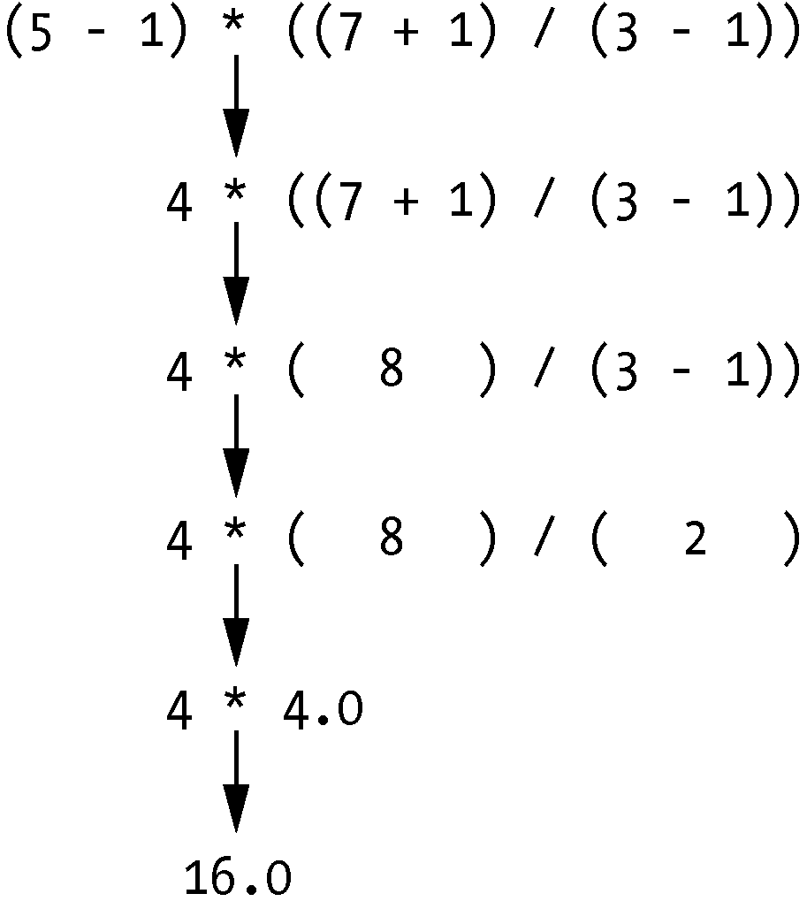

### 1.1　在交互式环境中输入表达式

可以通过启动Mu编辑器来运行交互式环境，你在阅读前言中的安装说明时应该已经下载了Mu编辑器。在Windows操作系统上，打开“开始”菜单，输入“Mu”，然后打开Mu应用程序。在macOS上，打开“应用程序”文件夹，然后双击Mu；单击New按钮，然后将一个空文件另存为blank.py；当你通过单击Run按钮或按F5键运行这个空白文件时，它将打开交互式环境，该环境将作为一个新窗格打开，该窗格在Mu编辑器窗口的底部打开。你应该可以在交互式环境中看到>>>提示符。

在提示符处输入 `2 + 2` ，让Python做一些简单的数学运算。Mu窗口现在应如下所示：

```javascript
>>> 2 + 2
4
>>>
```

在Python中，2 + 2称为“表达式”，它是语言中最基本的编程结构。表达式包含“值”（例如2）和“操作符”（例如+），并且总是可以“求值”（即归约）为单个值。这意味着在Python代码中，所有使用表达式的地方都可以使用一个值。

在前面的例子中， `2 + 2` 求值为单个值4。没有操作符的单个值也被认为是一个表达式，尽管它求值的结果就是它自己，像下面这样：

```javascript
>>> 2
2
```


**错误没关系！**

如果程序包含计算机不能理解的代码，就会崩溃，这将导致Python显示错误信息。错误信息并不会破坏你的计算机，所以不要害怕犯错误。“崩溃”只是意味着程序意外地停止执行。

如果你希望对一条错误信息了解更多，可以在网上查找这条错误信息的准确文本，找到关于这个错误的更多内容。也可以进入No Starch出版社官网本书对应页面，那里有常见的Python错误信息和含义的列表。


Python表达式中也可以使用大量其他操作符。例如，表 1-1 列出了Python的所有数学操作符。

<center class="my_markdown"><b class="my_markdown">表1-1　Python数学操作符，优先级从高到低</b></center>

| 操作符 | 操作 | 例子 | 求值为 |
| :-----  | :-----  | :-----  | :-----  | :-----  | :-----  |
| ** | 指数 | 2 ** 3 | 8 |
| % | 取模/取余数 | 22 % 8 | 6 |
| // | 整除/商数取整 | 22 // 8 | 2 |
| / | 除法 | 22 / 8 | 2.75 |
| * | 乘法 | 3 * 5 | 15 |
| − | 减法 | 5 − 2 | 3 |
| + | 加法 | 2 + 2 | 4 |

Python数学操作符的“操作顺序”（也称为“优先级”）与数学中类似。**操作符首先求值；接下来是*、/、//和%操作符，从左到右；+和−操作符最后求值，也是从左到右。如果需要，可以用括号来改变通常的优先级。运算符和值之间的空格对于Python无关紧要（行首的缩进除外），但是惯例是保留一个空格。在交互式环境中输入下列表达式：

```javascript
>>> 2 + 3 * 6
20
>>> (2 + 3) * 6
30
>>> 48565878 * 578453
28093077826734
>>> 2 ** 8
256
>>> 23 / 7
3.2857142857142856
>>> 23 // 7
3
>>> 23 % 7
2
>>> 2 + 2
4
>>> (5 - 1) * ((7 + 1) / (3 - 1))
16.0
```

在每个例子中，作为程序员，你必须输入表达式，由Python完成较难的工作，将它求值为单个值。Python将继续对表达式的各个部分进行求值，直到它成为单个值，如右所示。


将操作符和值放在一起构成表达式的这些规则，是 Python 编程语言的基本部分，就像帮助我们沟通的语法规则一样。下面是例子。

This is a grammatically correct English sentence.

This grammatically is sentence not English correct a.

第二行很难解释，因为它不符合自然语言的规则。类似地，如果你输入错误的 Python指令，Python也不能理解，就会显示出错误信息，像下面这样：

```javascript
>>> 5 +
  File "<stdin>", line 1
    5 +
      ^
SyntaxError: invalid syntax
>>> 42 + 5 + * 2
  File "<stdin>", line 1
    42 + 5 + * 2
             ^
SyntaxError: invalid syntax
```

你总是可以在交互式环境中输入一条指令，检查它是否能工作。不要担心会弄坏计算机：最坏的情况就是Python显示错误信息。专业的软件开发者在编写代码时，常常会遇到错误信息。

