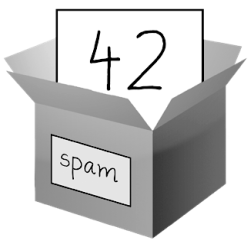

### 1.4.1　赋值语句

用“赋值语句”将值保存在变量中。赋值语句包含一个变量名、一个等号（称为“赋值操作符”），以及要存储的值。如果输入赋值语句 `spam = 42` ，那么名为 `spam` 的变量将保存一个整型值42。

可以将变量看成一个带标签的盒子，值放在其中，如图1-1所示。


<center class="my_markdown"><b class="my_markdown">图1-1　 `spam`  = 42就像是告诉程序“变量 `spam` 现在有整型值42放在里面”</b></center>

例如，在交互式环境中输入以下内容：

```javascript
❶ >>> spam = 40
  >>> spam
  40
  >>> eggs = 2
❷ >>> spam + eggs
  42
  >>> spam + eggs + spam
  82
❸ >>> spam = spam + 2
  >>> spam
  42
```

第一次存入一个值，变量就被“初始化”（或创建）❶。此后，可以在表达式中使用它，以及其他变量和值❷。如果变量被赋了一个新值，老值就被忘记了❸。这就是为什么在例子结束时， `spam` 求值为42，而不是40。这称为“覆写”该变量。在交互式环境中输入以下代码，尝试覆写一个字符串：

```javascript
>>> spam = 'Hello'
>>> spam
'Hello'
>>> spam = 'Goodbye'
>>> spam
'Goodbye'
```

就像图1-2所示的盒子，这个例子中的 `spam` 变量保存了 `'Hello'` ，直到你用 `'Goodbye'` 替代它。


<center class="my_markdown"><b class="my_markdown">图1-2　一个新值赋给变量，老值就被遗忘了</b></center>

