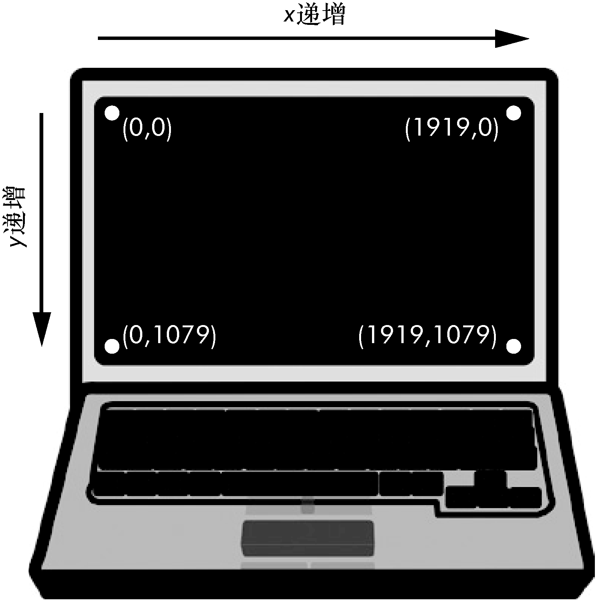

### 20.4　控制鼠标指针

在本节中，你将学习如何利用PyAutoGUI移动鼠标指针，并追踪它在屏幕上的位置，但首先需要理解PyAutoGUI如何处理坐标。

PyAutoGUI的鼠标函数使用x、y坐标。图20-1所示为计算机屏幕的坐标系统。它与第19章中讨论的图像坐标系统类似。“原点”的x、y都是0，在屏幕的左上角。向右x坐标值增加，向下y坐标值增加。所有坐标都是正整数，没有负数坐标。


<center class="my_markdown"><b class="my_markdown">图20-1　分辨率为1920像素 × 1080像素的计算机屏幕上的坐标</b></center>

“分辨率”是指屏幕的宽度和高度的像素值。如果屏幕的分辨率设置为1920像素 × 1080像素，那么左上角的坐标是(0, 0)，右下角的坐标是(1919, 1079)。

`pyautogui.size()` 函数返回两个整数的元组，包含屏幕的宽度和高度的像素数。在交互式环境中输入以下内容：

```javascript
>>> import pyautogui
>>> wh = pyautogui.size() # Obtain the screen resolution.
>>> wh
Size(width=1920, height=1080)
>>> wh[0]
1920
>>> wh.width
1920
```

在分辨率为1920像素 × 1080像素的计算机上， `pyautogui.size()` 返回 `(1920, 1080)` 。根据屏幕分辨率的不同，返回值可能不一样。 `size()` 返回的 `size` 对象是一个命名的元组。

“命名的元组”有数字索引，就像普通的元组一样，属性名也像对象一样： `wh[0]` 和 `wh.width` 都是以屏幕的宽度为值。（命名的元组超出了本书的范围。只要记住，你可以像使用元组一样使用它们。）

