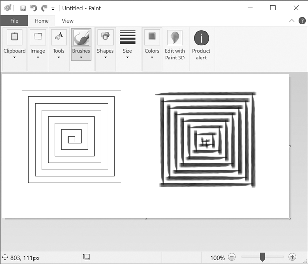

### 20.5.2　拖动鼠标

“拖动”意味着移动鼠标指针，同时按住一个按键不放。例如，可以通过拖动文件图标，在文件夹之间移动文件，或在日历应用中移动预约。

`pyautogui` 提供了 `pyautogui.dragTo()` 和 `pyautogui.drag()` 函数，将鼠标指针拖动到一个新的位置。 `dragTo()` 和 `drag()` 的参数与 `moveTo()` 和 `move()` 相同：x坐标/水平移动，y坐标/垂直移动，以及可选的时间间隔（在macOS上，如果鼠标移动太快，拖动会不对，所以建议提供 `duration` 关键字参数）。

要尝试使用这些函数，请打开一个绘图应用，如Windows操作系统上的Paint、macOS上的Paintbrush，或Linux操作系统上的GNU Paint（如果没有绘图应用，则可以在线绘图工具）。我将使用PyAutoGUI在这些应用中绘图。

让鼠标指针停留在绘图应用的画布上，同时选中铅笔或画笔工具，在新的文件编辑器窗口中输入以下内容，保存为spiralDraw.py：

```javascript
  import pyautogui, time
❶ time.sleep(5)
❷ pyautogui.click()    # Click to make the window active.
  distance = 300
  change  =  20
  while distance > 0:
   ❸ pyautogui.drag(distance, 0, duration=0.2)     # Move right.
   ❹ distance = distance – change
   ❺ pyautogui.drag(0, distance, duration=0.2)     # Move down.
   ❻ pyautogui.drag(-distance, 0, duration=0.2)   # Move left.
      distance = distance – change
      pyautogui.drag(0, -distance, duration=0.2)    # Move up.
```

在运行这个程序时，会有5秒的延迟❶，让你选中铅笔或画笔工具，并让鼠标指针停留在画图工具的窗口上。然后spiralDraw.py将控制鼠标，单击画图程序获得焦点❷。如果窗口有闪烁的鼠标指针，它就获得了“焦点”，这时你的动作（例如打字或这个例子中的拖动鼠标）就会影响该窗口。画图程序获取焦点后，spiralDraw.py将绘制一个正方形旋转图案，如图20-2左边所示。虽然你也可以使用第19章中讨论的 `pillow` 模块来创建一个正方形的螺旋形图像，但是通过控制鼠标在Paint中绘制图像，你可以利用这个程序的各种笔刷样式来创建图像，如图20-2右边所示，以及实现其他高级功能，如渐变或颜色填充。你可以自己预选笔刷设置（或者让你的Python代码选择这些设置），然后运行螺旋绘图程序。

`distance` 变量从 300 开始，所以在 `while` 循环的第一次迭代中，第一次 `drag()`  调用将鼠标指针向右拖动300像素，花了0.2秒❸。然后 `distance` 降到280❹，第二次 `drag()`  调用将鼠标指针向下拖动280像素❺。第三次 `drag()`  调用将鼠标指针水平拖动−280（向左280）❻。 `distance` 降到260，最后一次 `drag()`  调用将鼠标指针向上拖动260。每次迭代，鼠标指针都向右、向下、向左、向上拖动， `distance` 都比前一次迭代小一点。通过这段代码循环，就可以移动鼠标指针，画出正方形旋转图案。


<center class="my_markdown"><b class="my_markdown">图20-2  `pyautogui.drag()` 例子的结果，用MS Paint的不同画笔绘制</b></center>

可以手动（或者说用鼠标）画出这个漩涡，但一定要画得很慢才能这么精确。而PyAutoGUI只需几秒就能画完！


**注意：**
在本书编写时，PyAutoGUI无法将鼠标单击或按键事件发送至某些程序，例如杀毒软件（为了防止病毒禁用该软件）或Windows操作系统上的视频游戏（使用不同的方法接收鼠标和键盘输入）。你可以查看最新的PyAutoGUI在线文档，看看是否添加了这些功能。


