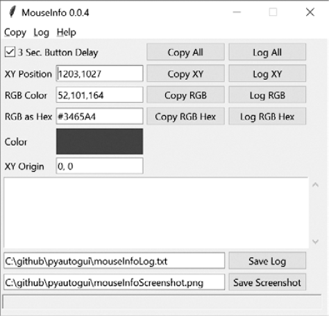

### 20.6　规划鼠标运动

编写一个能自动单击屏幕的程序的难点之一，就是找到你想单击的物品的x坐标和y坐标。 `pyautogui.mouseInfo()` 函数可以帮助你解决这个问题。

`pyautogui.mouseInfo()` 函数需要在交互式环境中调用，而不是作为程序的一部分。它启动了一个名为MouseInfo的小应用程序，该应用程序是PyAutoGUI的一部分。这个应用程序的窗口看起来如图20-3所示。


<center class="my_markdown"><b class="my_markdown">图20-3　MouseInfo应用程序的窗口</b></center>

在交互式环境中输入以下代码：

```javascript
>>> import pyautogui
>>> pyautogui.mouseInfo()
```

这导致MouseInfo窗口出现。该窗口提供了关于鼠标指针当前位置的信息，以及鼠标指针处的像素的颜色，以3个整数的RGB元组和十六进制值的形式显示。颜色本身会出现在窗口中的颜色框中。

为了帮助记录这些坐标或像素信息，你可以单击8个复制或日志记录按钮中的一个。Copy All、Copy XY、Copy RGB和Copy RGB Hex按钮将对应的信息复制到剪贴板上。Log All、Log XY、Log RGB和Log RGB Hex按钮将对应的信息写入窗口中的大文本字段。你可以通过单击Save Log按钮，保存这个文本字段中的文本。

默认情况下，3秒按钮延迟复选框被勾选，在单击复制或日志访谈录按钮与复制或日志记录之间，会有3秒的延迟。这让你有很短的时间来单击按钮，然后将鼠标指针移动到所需的位置。

取消勾选此复选框，将鼠标指针移动到指定位置，然后按F1到F8键复制或使用日志记录鼠标指针位置，这样可能更容易。你可以查看MouseInfo窗口顶部的复制和日志记录菜单，了解哪些键映射到哪些按钮。

例如，取消勾选3秒按钮延迟复选框，然后按F6键的同时在屏幕上移动鼠标指针，并注意鼠标指针是如何在屏幕上移动的。鼠标指针的x和y坐标被记录在窗口中间的大文本字段中。你可以在以后的PyAutoGUI脚本中使用这些坐标。

