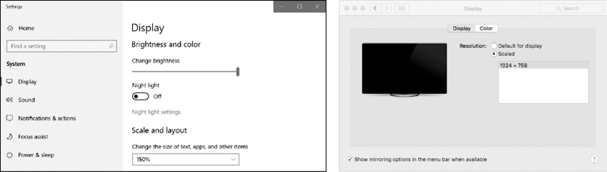

### 20.8　图像识别

如果事先不知道PyAutoGUI应该单击哪里，该怎么办？可以使用图像识别功能，向PyAutoGUI提供希望单击的图像，让它去弄清楚坐标。

例如，如果你以前获得了屏幕快照，截取了提交按钮的图像，保存为submit.png，那么 `locateOnScreen()` 函数将返回图像所在处的坐标。要了解 `locateOnScreen()` 函数的工作方式，请获取屏幕上一小块区域的屏幕快照，保存该图像，并在交互式环境中输入以下内容，用你的屏幕快照文件名代替 `'submit.png'` ：

```javascript
>>> import pyautogui
>>> b = pyautogui.locateOnScreen('submit.png')
>>> b
Box(left=643,  top=745,  width=70,  height=29)
>>> b[0]
643
>>> b.left
643
```

`Box` 对象是一个命名的元组，它由 `locateOnScreen()` 函数返回，是屏幕上首次发现该图像时左边的x坐标、顶边的y坐标、宽度以及高度。如果你用自己的屏幕快照在你的计算机上尝试，那么返回值会和这里显示的不一样。

如果屏幕上找不到该图像， `locateOnScreen()` 函数将返回 `None` 。请注意，要成功识别，屏幕上的图像必须与提供的图像完全匹配。即使只差一个像素， `locateOnScreen()` 函数也会引发 `ImageNotFoundException` 异常。如果你改变了屏幕分辨率，之前截取的图片可能会与当前屏幕上的图片不一致。你可以在操作系统的显示设置中更改缩放比例，如图20-4所示。


<center class="my_markdown"><b class="my_markdown">图20-4　Windows 10操作系统（左）和macOS（右）中的缩放比例显示设置</b></center>

如果该图像在屏幕上能够找到多处， `locateAllOnScreen()` 函数将返回一个 `Generator` 对象。可以将它传递给 `list()` ，返回一个4个整数元组的列表。在屏幕上找到图像的每个位置，都会有一个4个整数元组。继续在交互式环境的例子中输入以下内容（用你自己的图像文件名取代 `'submit.png'` ）：

```javascript
>>> list(pyautogui.locateAllOnScreen('submit.png'))
[(643, 745, 70, 29), (1007, 801, 70, 29)]
```

每个４整数元组代表了屏幕上的一个区域。如果图像只找到一次，那么就使 `list()` 和 `locateAllOnScreen()` 返回的列表只包含一个元组。

在得到图像所在屏幕区域的4个整数元组后，就可以单击这个区域的中心，将该元组传递给 `click()` ，在交互式环境中输入以下内容：

```javascript
>>> pyautogui.click((643, 745, 70, 29))
```

作为快捷方式，你也可以直接将图像文件名传递给 `click()` 函数：

```javascript
>>> pyautogui.click('submit.png')
```

`moveTo()` 和 `dragTo()` 函数也接收图像文件名参数。请记住，如果 `locateOnScreen()` 在屏幕上找不到图像，就会引发异常，因此应该在 `try` 语句中调用它：

```javascript
try:
   location = pyautogui.locateOnScreen('submit.png')
except:
   print('Image could not be found.')
```

没有 `try` 和 `except` 语句，未捕获的异常将导致程序崩溃。由于你无法确定程序总能找到该图像，因此在调用 `locateOnScreen()` 时最好使用 `try` 和 `except` 语句。

