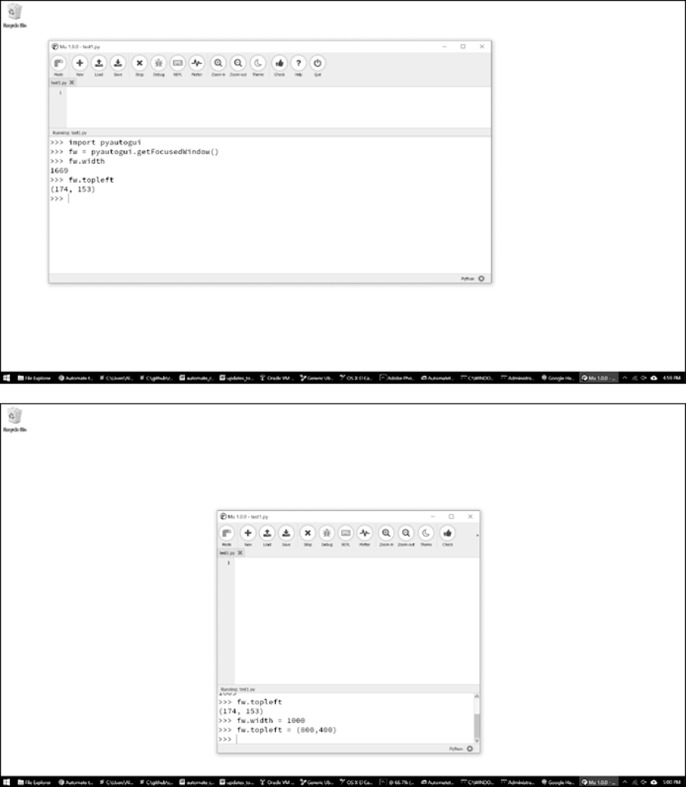

### 20.9.3　操纵窗口

窗口属性不仅可以告诉你窗口的大小和位置，还可以做更多的事情。你也可以设置它们的值，以便调整窗口大小或移动窗口。例如，在交互式环境中输入以下内容：

```javascript
  >>> import pyautogui
  >>> fw = pyautogui.getActiveWindow()
❶ >>> fw.width # Gets the current width of the window.
   1669
❷ >>> fw.topleft # Gets the current position of the window. 
   (174, 153)
❸ >>> fw.width = 1000 # Resizes the  width.
❹ >>> fw.topleft = (800, 400) # Moves the window.
```

首先，我们使用 `Window` 对象的属性来查找有关窗口大小❶和位置❷的信息。在Mu编辑器中调用这些函数后，窗口应该变窄❸并移动❹，如图20-5所示。


<center class="my_markdown"><b class="my_markdown">图20-5　利用 `Window` 对象属性移动（并调整其大小）之前（上）和之后（下）的Mu编辑器窗口</b></center>

你还可以发现并更改窗口的最小化、最大化和激活状态。尝试在交互式环境中输入以下内容：

```javascript
   >>> import pyautogui
   >>> fw = pyautogui.getActiveWindow()
❶  >>> fw.isMaximized # Returns True if window is maximized.
   False
❷  >>> fw.isMinimized # Returns True if window is minimized.
   False
❸  >>> fw.isActive # Returns True if window is the active window.
   True
❹  >>> fw.maximize() # Maximizes the window.
   >>> fw.isMaximized
   True
❺  >>> fw.restore() # Undoes a minimize/maximize action.
❻  >>> fw.minimize() # Minimizes the window.
   >>> import time
   >>> # Wait 5 seconds while you activate a different window:
❼  >>> time.sleep(5); fw.activate()
❽  >>> fw.close() # This will close the window you're typing in.
```

`isMaximized` ❶、 `isMinimized`  ❷和 `isActive`  ❸属性包含指示窗口当前是否处于该状态的布尔值。 `maximize()` ❹、 `restore()` ❺、 `minimize()` ❻和 `activate()` ❼方法更改窗口的状态。使用 `maximum()` 或 `minimal()` 最大化或最小化窗口后， `restore()` 方法会将窗口还原到以前的大小和位置。

`close()` 方法❽将关闭一个窗口。注意使用这种方法，因为它可能会绕过要求你在退出应用程序之前保存所做工作的所有消息对话框。

此外，你也可以通过 `PyGetWindow` 模块，将这些功能与PyAutoGUI分开使用。

