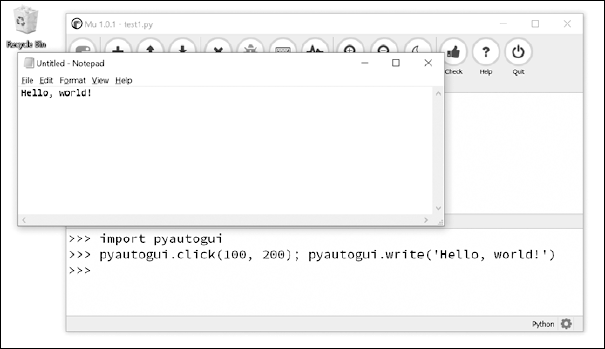

### 20.10.1　通过键盘发送一个字符串

`pyautogui.write()`  函数向计算机发送虚拟按键操作。这些操作产生什么效果，取决于当前获得焦点的窗口和文本输入框。我们可能需要先向文本框发送一次鼠标单击事件，确保它获得焦点。

举一个简单的例子，让我们用Python自动化在文件编辑器窗口中输入“Hello, world!”。首先，打开一个新的文件编辑器窗口，将它放在屏幕的左上角，以便PyAutoGUI单击正确的位置，让它获得焦点。然后，在交互式环境中输入以下内容：

```javascript
>>> pyautogui.click(100, 200); pyautogui.write('Hello, world!')
```

请注意，在同一行中放两个命令，用分号隔开，这让交互式环境不会在两个指令之间提示输入。这防止了你在 `click()` 和 `write()` 调用之间，不小心让新的窗口获得焦点，从而让这个例子失败。

Python首先在坐标（100, 200）处发出虚拟鼠标单击事件，这将单击文件编辑器窗口，让它获得焦点。 `write()`  函数调用将向窗口发送文本“Hello, world!”，结果如图20-6所示。现在有了替你打字的代码！


<center class="my_markdown"><b class="my_markdown">图20-6　用PyAutoGUI单击文件编辑器窗口，在其中输入Hello, world！</b></center>

默认情况下， `write()` 函数将立即输出完整字符串。但是，你可以传入可选的第二个参数，在每个字符之间添加短时间暂停。例如， `pyautogui.write('Hello, world!', 0.25)` 将在输出H后等待0.25秒，输出e以后再等待0.25秒，以此类推。这种渐进的打字机效果，对于较慢的应用可能有用，它们处理按键事件的速度不够快，跟不上PyAutoGUI。

对于A或!这样的字符，PyAutoGUI将自动模拟按住Shift键。

