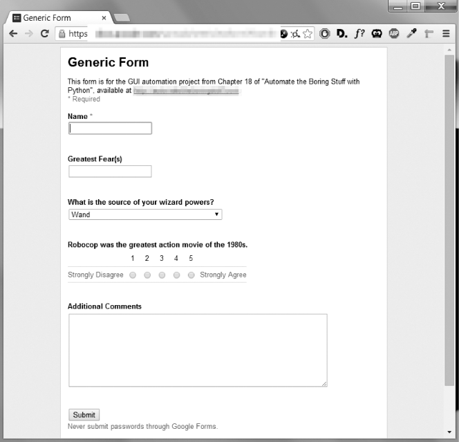

### 20.13　项目：自动填表程序

在所有繁琐的任务中，填表是最烦人的。在最后一章的项目中，你将搞定它。假设你在电子表格中有大量的数据，必须重复将它输入另一个应用的表单界面中，没有实习生帮你完成。尽管有些应用有导入功能，让你上传包含信息的电子表格，但有时候似乎没有其他方法，只能重复地单击和输入几个小时。读到了本书的这一章，你“当然”知道会有其他方法。

本项目的表单是Google Docs 表单，你可以在autbor+form的网站中找到，如图20-7所示。

<b class="my_markdown">图20-7　本项目用到的表单</b>

总的来说，程序应该完成以下任务。

1．单击表单的第一个文本字段。

2．遍历表单，在每个输入栏中输入信息。

3．单击Submit按钮。

4．用下一组数据重复这个过程。

这意味着代码需要执行以下操作。

1．调用 `pyautogui.click()` 函数，单击表单和 `Submit` 按钮。

2．调用 `pyautogui.write()` 函数，在输入栏中输入文本。

3．处理 `KeyboardInterrupt` 异常，这样用户能按Ctrl-C快捷键退出。

打开一个新的文件编辑器窗口，将它保存为formFiller.py。

