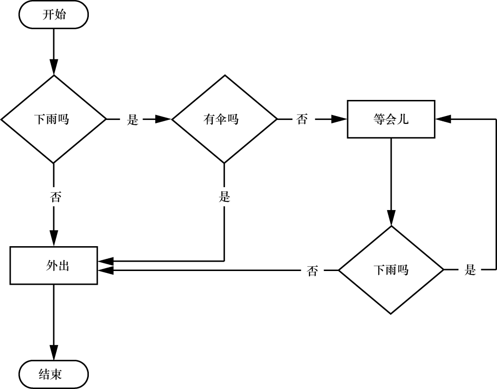

### 第2章　控制流

你已经知道了单条指令的基本知识，程序就是一系列指令。但编程真正的力量不仅在于运行（或“执行”）一条接一条的指令，就像周末的任务清单那样。根据表达式求值的结果，程序可以决定跳过指令、重复指令，或从几条指令中选择一条运行。实际上，你几乎不会希望程序从第一行代码开始，简单地执行每行代码，直到最后一行。“控制流语句”可以决定在什么条件下执行哪些Python语句。

这些控制流语句直接对应于流程图中的符号，所以在本章中，我将提供示例代码的流程图。图2-1所示为一张流程图，内容是如果下雨怎么办。按照箭头构成的路径，你将了解从开始到结束的所有步骤。

<b class="my_markdown">图2-1　一张流程图，告诉你如果下雨要做什么</b>

在流程图中，通常有不止一种方法从开始走到结束。计算机程序中的代码行也是这样。流程图用菱形表示这些分支节点，开始和结束步骤用带圆角的矩形表示，其他步骤用矩形表示。

但在学习控制流语句之前，要学习如何表示这些“是”和“否”选项。同时你也需要理解，如何将这些分支节点写成Python代码。做到这一点之前，让我们先看看布尔值、比较操作符和布尔操作符。

<b class="my_markdown">视频讲解</b>

