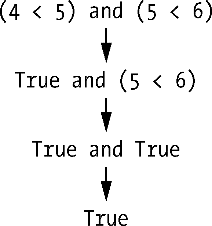

### 2.4　混合布尔和比较操作符

既然比较操作符求值为布尔值，那么就可以和布尔操作符一起在表达式中使用。

回忆一下， `and` 、 `or` 和 `not` 操作符称为布尔操作符是因为它们总是操作布尔值。虽然像 `4 < 5` 这样的表达式不是布尔值，但可以求值为布尔值。在交互式环境中，尝试输入一些使用比较操作符的布尔表达式：

```javascript
>>> (4 < 5) and (5 < 6)
True
>>> (4 < 5) and (9 < 6)
False
>>> (1 == 2) or (2 == 2)
True
```

计算机将先求值左边的表达式，然后求值右边的表达式。得到两个布尔值后，它又将整个表达式再求值为一个布尔值。计算机求值 `(4 < 5)` 和 `(5 < 6)` 的过程如下所示。


也可以在一个表达式中使用多个布尔操作符，与比较操作符一起使用：

```javascript
>>> 2 + 2 == 4 and not 2 + 2 == 5 and 2 * 2 == 2 + 2
True
```

和算术操作符一样，布尔操作符也有操作顺序。在所有算术和比较操作符求值后，Python先求值 `not` 操作符，然后求值 `and` 操作符，最后求值 `or` 操作符。

