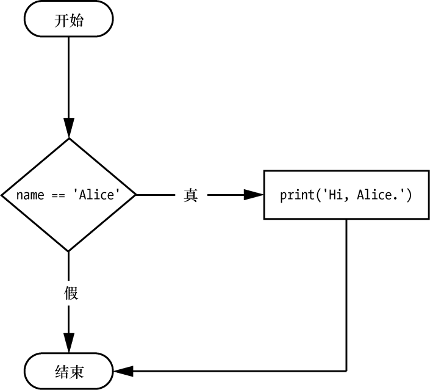

### 2.7.1　if语句

最常见的控制流语句是 `if` 语句。 `if` 语句的子句（也就是紧跟 `if` 语句的语句块），将在语句的条件为 `True` 时执行。如果条件为 `False` ，将跳过子句。

在自然语言中， `if` 语句念起来可能是：“如果条件为真，执行子句中的代码。”在Python中， `if` 语句包含以下部分。

+ `if` 关键字。
+ 条件（即求值为 `True` 或 `False` 的表达式）。
+ 冒号。
+ 在下一行开始，缩进的代码块（称为 `if` 子句）。

例如，假定有以下代码，用于检查某人的名字是否为Alice（假设此前曾为 `name` 赋值）：

```javascript
if name == 'Alice':
    print('Hi, Alice.')
```

所有控制流语句都以冒号结尾，后面跟着一个新的代码块（子句）。语句的 `if` 子句是代码块，包含 `print('Hi, Alice.')` 。图2-2所示为这段代码的流程图。


<center class="my_markdown"><b class="my_markdown">图2-2  `if` 语句的流程图</b></center>

