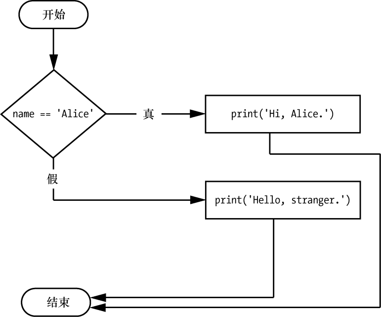

### 2.7.2　else语句

`if` 子句后面有时候也可以跟着 `else` 语句。只有 `if` 语句的条件为 `False` 时， `else` 子句才会执行。在自然语言中， `else` 语句念起来可能是：“如果条件为真，执行这段代码；否则，执行那段代码。” `else` 语句不包含条件，在代码中， `else` 语句包含以下部分。

+ `else` 关键字。
+ 冒号。
+ 在下一行开始，缩进的代码块（称为 `else` 子句）。

回到名字检查程序的例子，我们来看看使用 `else` 语句的一些代码，在名字不是Alice时，发出不一样的问候：

```javascript
if name == 'Alice':
    print('Hi, Alice.')
else:
    print('Hello, stranger.')
```

图2-3所示为这段代码的流程图。


<center class="my_markdown"><b class="my_markdown">图2-3　 `else` 语句的流程图</b></center>

