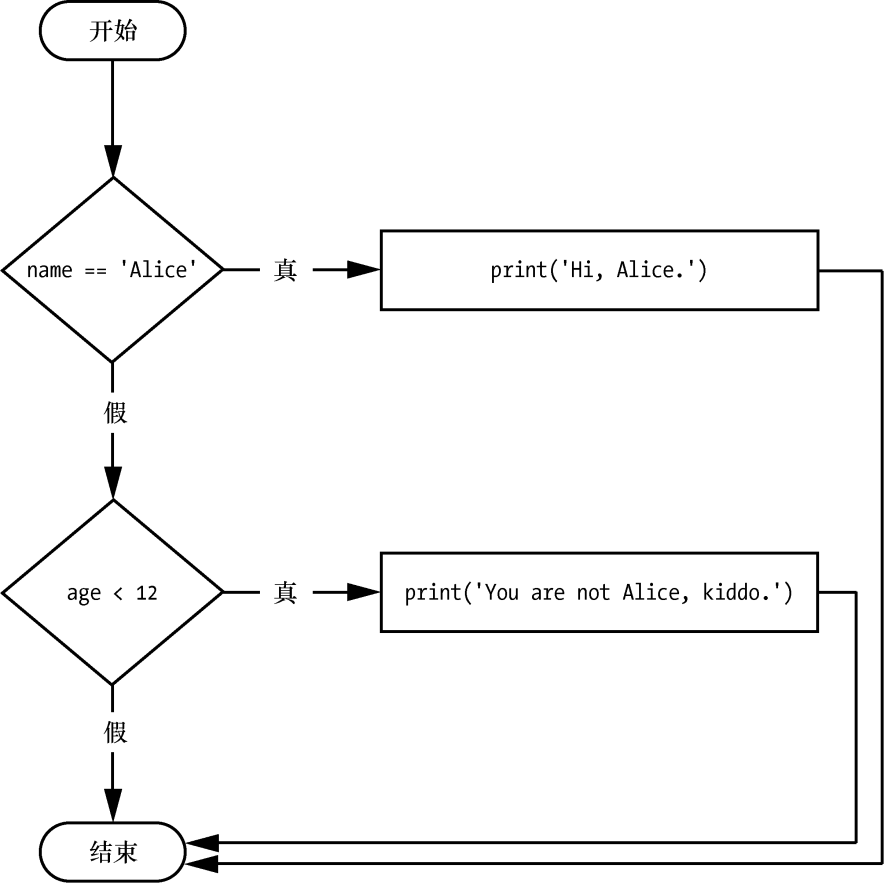
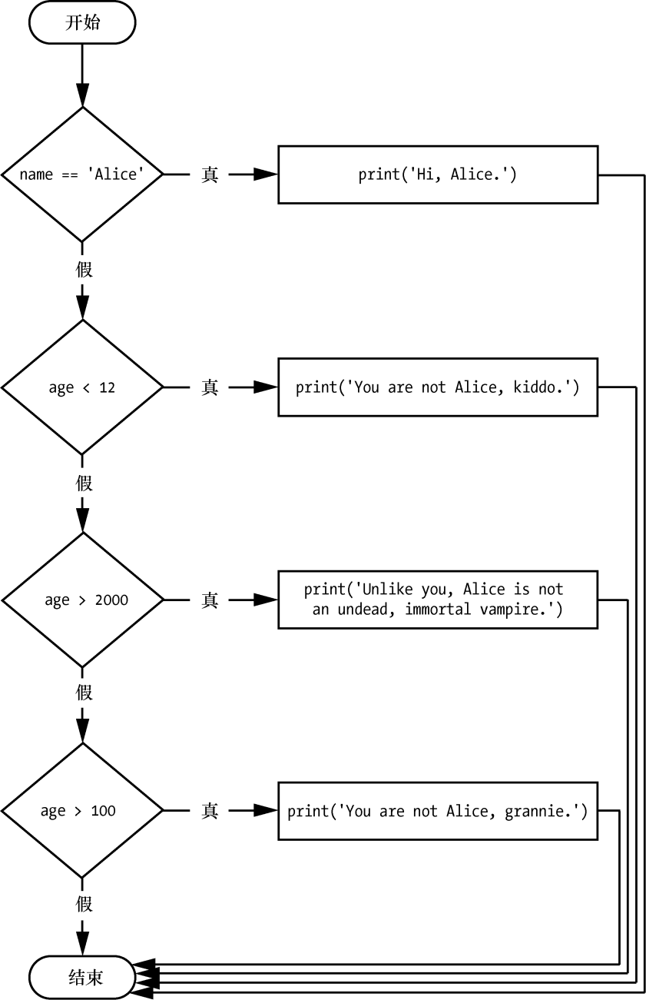
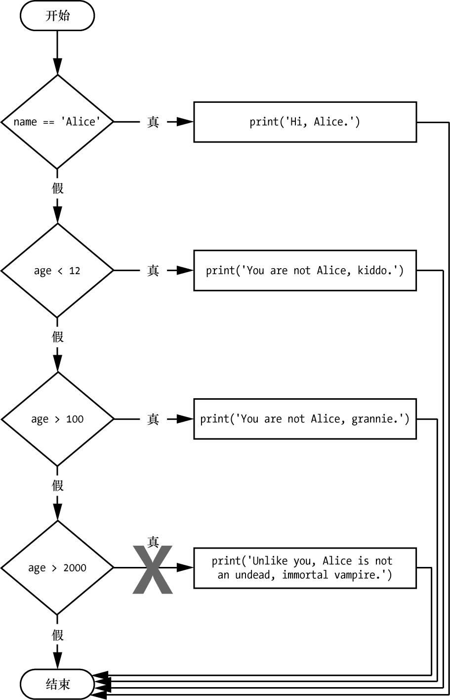
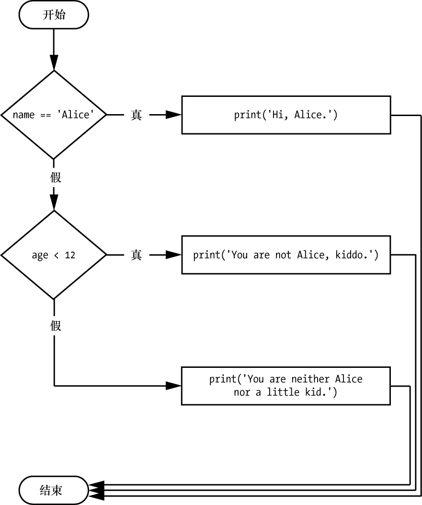

### 2.7.3　elif语句

虽然只有 `if` 或 `else` 子句会被执行，但有时候希望“许多”可能的子句中有一个被执行。 `elif` 语句是“否则如果”，总是跟在 `if` 或另一条 `elif` 语句后面。它提供了另一个条件，仅在前面的条件为 `False` 时才检查该条件。在代码中， `elif` 语句总是包含以下部分。

+ `elif` 关键字。
+ 条件（即求值为 `True` 或 `False` 的表达式）。
+ 冒号。
+ 在下一行开始，缩进的代码块（称为 `elif` 子句）。

让我们在名字检查程序中添加 `elif` ，看看这个语句的效果：

```javascript
if name == 'Alice':
    print('Hi, Alice.')
elif age < 12:
    print('You are not Alice, kiddo.')
```

这一次，检查此人的年龄。如果比 12 岁小，就告诉他一些不同的东西。图2-4所示为这段代码的流程图。


<center class="my_markdown"><b class="my_markdown">图2-4  `elif` 语句的流程图</b></center>

如果 `age < 12` 为 `True` ，并且 `name == 'Alice'` 为 `False` ， `elif` 子句就会执行。但是，如果两个条件都为 `False` ，那么两个子句都会被跳过。“不能”保证至少有一个子句会被执行。如果有一系列的 `elif` 语句，仅有一条或零条子句会被执行，一旦一个语句的条件为 `True` ，会自动跳过剩下的 `elif` 子句。例如，打开一个新的文件编辑器窗口，输入以下代码，保存为vampire.py：

```javascript
name  =  'Carol' 
age = 3000
if name == 'Alice':
 print('Hi, Alice.')
elif age < 12: 
 print('You are not Alice, kiddo.') 
elif age > 2000: 
 print('Unlike you, Alice is not an undead, immortal vampire.') 
elif age > 100: 
 print('You  are  not  Alice,  grannie.') 
```

可以在https://autbor.com/vampire/上查看该程序的执行情况。这里，我添加了另外两条 `elif` 语句，让名字检查程序根据 `age` 的不同答案而发出问候。图2-5所示为这段代码的流程图。


<center class="my_markdown"><b class="my_markdown">图2-5 vampire.py程序中多重 `elif` 语句的流程图</b></center>

`elif` 语句的次序很重要。让我们重新排序，引入一个bug。回忆一下，一旦找到一个 `True` 条件，就会自动跳过剩余的子句。所以如果交换vampire.py中的一些子句，就会遇到问题。像下面这样改变代码，将它保存为vampire2.py：

```javascript
  name  =  'Carol'
  age = 3000
  if name == 'Alice': 
       print('Hi, Alice.') 
  elif age < 12: 
      print('You  are  not  Alice,  kiddo.') 
❶ elif age  >  100: 
      print('You are not Alice, grannie.') 
  elif age > 2000: 
      print('Unlike you, Alice is not an undead, immortal vampire.')
```

可以在https://autbor.com/vampire2/上查看该程序的执行情况。假设在这段代码执行之前， `age` 变量的值是 `3000` 。你可能预计代码会输出字符串 `'Unlike you, Alice is not an undead, immortal vampire.'` 。但是，因为 `age > 100` 条件为真（ `3000` 大于 `100` ）❶，字符串 `'You are not Alice, grannie.'` 被输出，自动跳过剩下的语句。别忘了，最多只有一个子句会执行，所以对于 `elif` 语句，次序是很重要的。

图2-6所示为前面代码的流程图。请注意，菱形 `age > 100` 和 `age > 2000` 交换了位置。


<center class="my_markdown"><b class="my_markdown">图2-6　vampire2.py程序的流程图。打叉的路径在逻辑上永远不会发生，因为如果 `age` 大于2000，它就已经大于100了</b></center>

你可以选择在最后的 `elif` 语句后面加上 `else` 语句。在这种情况下，保证有且只有一个子句会被执行。如果每个 `if` 和 `elif` 语句中的条件都为 `False` ，就执行 `else` 子句。例如，让我们使用 `if` 、 `elif` 和 `else` 子句重新编写名字检查程序：

```javascript
name  =  'Carol' 
age = 3000
if name == 'Alice': 
     print('Hi, Alice.') 
elif age < 12:
     print('You are not Alice, kiddo.') 
else: 
    print('You are neither Alice nor a little kid.') 
```

可以在https://autbor.com/littlekid/ 上查看该程序的执行情况。图2-7所示为这段新代码的流程图，我们将它保存为littleKid.py。


<center class="my_markdown"><b class="my_markdown">图2-7　littleKid.py程序的流程图</b></center>

在自然语言中，这类控制流结构为：“如果第一个条件为真，做这个；如果第二个条件为真，做那个；否则，做另外的事。”如果你同时使用 `if` 、 `elif` 和 `else` 语句，要记住这些次序规则，避免出现图2-6所示的bug。首先，总是只有一个 `if` 语句，所有需要的 `elif` 语句都应该跟在 `if` 语句之后；其次，如果希望确保至少一条子句被执行，那么在最后加上 `else` 语句。

