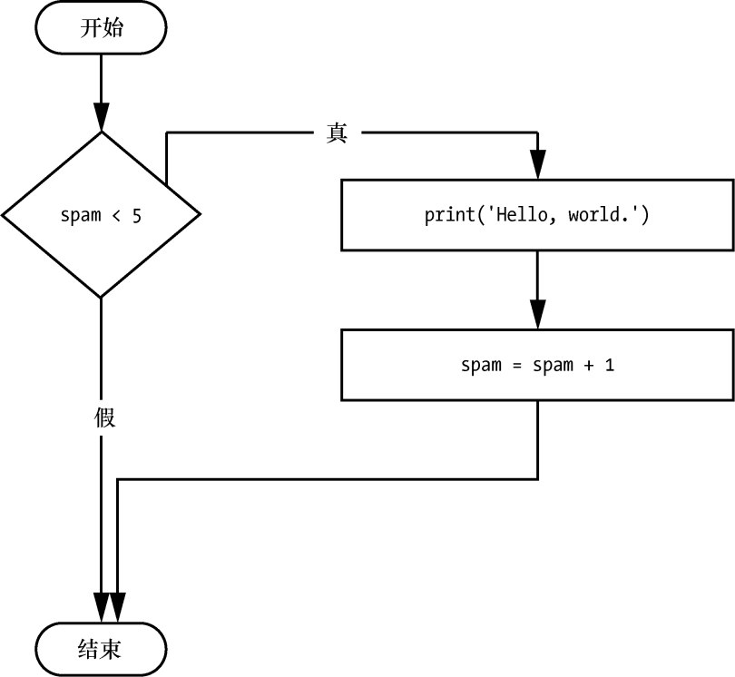
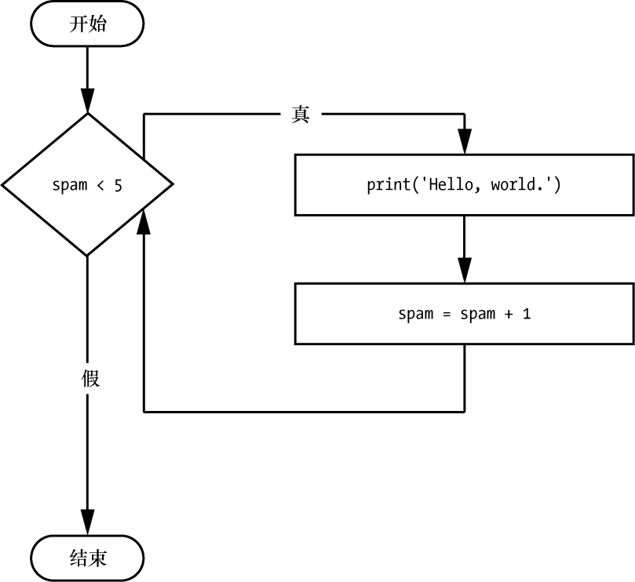

### 2.7.4　while循环语句

利用 `while` 循环语句，可以让一个代码块一遍又一遍地执行。只要 `while` 循环语句的条件为 `True` ， `while` 子句中的代码就会执行。在代码中， `while` 循环语句总是包含以下几部分。

+ `while` 关键字。
+ 条件（求值为 `True` 或 `False` 的表达式）。
+ 冒号。
+ 从下一行开始，缩进的代码块（称为 `while` 子句）。

可以看到， `while` 循环语句看起来和 `if` 语句类似。不同之处是它们的行为。 `if` 子句结束时，程序继续执行 `if` 语句之后的语句。但在 `while` 子句结束时，程序跳回到 `while` 循环语句开始处执行。 `while` 子句常被称为“ `while` 循环”，或就是“循环”。

让我们来看一个 `if` 语句和一个 `while` 循环。它们使用同样的条件，并基于该条件做出同样的动作。下面是 `if` 语句的代码：

```javascript
spam = 0
if spam < 5:
    print('Hello, world.')
    spam = spam + 1
```

下面是 `while` 循环语句的代码：

```javascript
spam = 0
while spam < 5:
    print('Hello, world.')
    spam = spam + 1
```

这些语句类似， `if` 和 `while` 都检查 `spam` 的值，如果它小于5，就输出一条消息。但如果运行这两段代码，它们各自的表现非常不同。对于 `if` 语句，输出就是 `"Hello, world."` 。但对于 `while` 语句，输出是 `"Hello, world."` 重复了5次。看一看这两段代码的流程图，如图2-8和图2-9所示，找一找原因。


<center class="my_markdown"><b class="my_markdown">图2-8　 `if` 语句代码的流程图</b></center>


<center class="my_markdown"><b class="my_markdown">图2-9　 `while` 循环语句代码的流程图</b></center>

带有 `if` 语句的代码检查条件，如果条件为 `True` ，就输出一次 `"Hello, world."` 。带有 `while` 循环的代码则不同，会输出5次。输出5次后停下来是因为在每次循环迭代末尾， `spam` 中的整数都增加1。这意味着循环将执行5次，然后 `spam < 5` 变为 `False` 。

在 `while` 循环中，条件总是在每次“迭代”开始时检查（也就是每次循环执行时）。如果条件为 `True` ，子句就会执行，然后再次检查条件；当条件第一次为 `False` 时，就跳过 `while` 子句。

