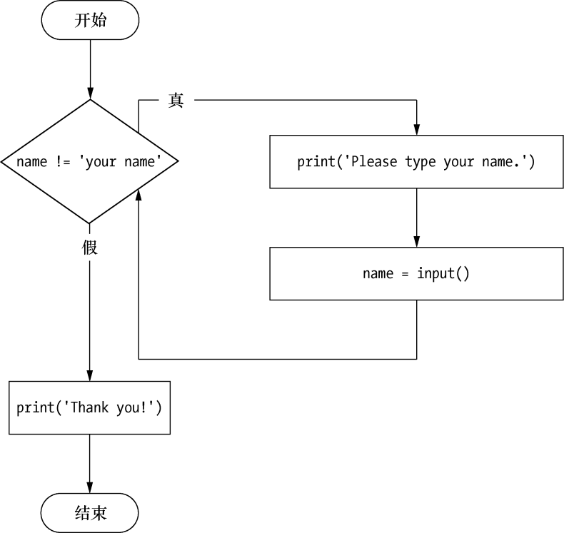

### 2.7.5　恼人的循环

这里有一个小例子，它不停地要求你输入“your name”（就是这个字符串，而不是你的名字）。选择FileNew Window，打开一个新的文件编辑器窗口，输入以下代码，将文件保存为yourName.py：

```javascript
❶ name = ''
❷ while name != 'your name':
       print('Please type your name.')
     ❸ name = input()
❹ print('Thank you!')
```

可以在https://autbor.com/yourname/上查看这个程序的执行情况。首先，程序将变量 `name` ❶设置为一个空字符串。这样，条件 `name != 'your name'` 就会求值为 `True` ，程序就会进入 `while` 循环的子句❷。

这个子句内的代码要求用户输入他们的名字，然后赋给 `name` 变量❸。因为这是语句块的最后一行，所以执行就回到 `while` 循环的开始，重新对条件求值。如果 `name` 中的值“不等于”字符串 `'your name'` ，那么条件就为 `True` ，执行将再次进入 `while` 子句。

但如果用户输入 `your name` ， `while` 循环的条件就变成 `'your name' != 'your name'` ，它求值为 `False` 。条件现在是 `False` ，程序就不会再次进入 `while` 子句，而是跳过它，继续执行程序后面的部分❹。图2-10所示为yourName.py程序的流程图。


<center class="my_markdown"><b class="my_markdown">图2-10　yourName.py程序的流程图</b></center>

现在，让我们来看看yourName.py程序的效果。按F5键运行它，输入几次 `your name` 之外的东西，然后再提供程序想要的输入：

```javascript
Please type your name.
Al
Please type your name.
Albert
Please type your name.
%#@#%*(^&!!!
Please type your name.
your name
Thank you!
```

如果永不输入 `your name` ，那么循环的条件就永远为 `True` ，程序将永远执行下去。这里， `input()` 调用让用户输入正确的字符串，以便让程序继续。在其他程序中，条件可能永远没有实际变化，这可能会出问题。让我们来看看如何跳出循环。

