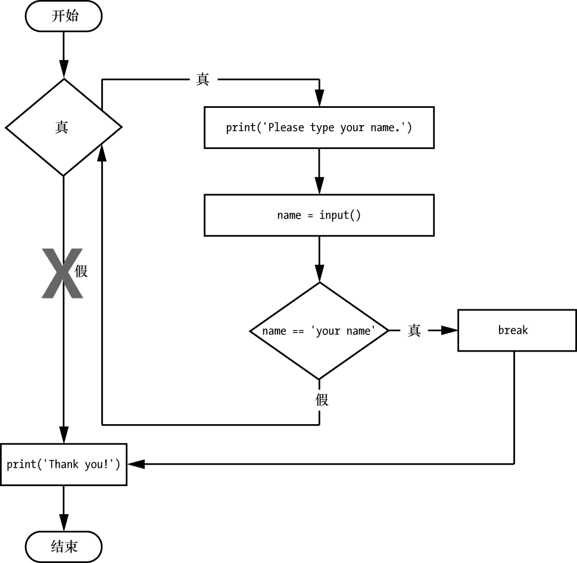

### 2.7.6　break语句

有一个捷径可以让执行提前跳出 `while` 子句。如果执行遇到 `break` 语句，就会马上退出 `while` 子句。在代码中， `break` 语句仅包含 `break` 关键字。

非常简单，对吗？这里有一个程序，和前面的程序做一样的事情，但使用了 `break` 语句来跳出循环。输入以下代码，将文件保存为yourName2.py：

```javascript
❶ while True:
       print('Please type your name.')
     ❷ name = input()
     ❸ if name == 'your name':
          ❹ break
❺ print('Thank you!')
```

可以在https://autbor.com/yourname2/上查看该程序的执行情况。第一行❶创建了一个“无限循环”，它是一个条件总是为 `True` 的 `while` 循环。（表达式 `True` 总是求值为 `True` 。）程序执行将总是进入循环，只有遇到 `break` 语句时才会退出（“永远不”退出的无限循环是一个常见的编程bug）。

像以前一样，程序要求用户输入 `your name` ❷。但是现在，虽然执行仍然在 `while` 循环内，但有一个 `if` 语句会被执行❸，检查 `name` 是否等于 `your name` 。如果条件为 `True` ， `break` 语句就会执行❹，然后会跳出循环，转到 `print('Thank you!')`  ❺；否则，就会跳过包含 `break` 语句的 `if` 语句子句，让执行到达 `while` 循环的末尾。此时，程序执行跳回到 `while` 循环语句的开始❶，重新检查条件。因为条件是 `True` ，所以执行进入循环，再次要求用户输入 `your name` 。这个程序的流程如图2-11所示。


<center class="my_markdown"><b class="my_markdown">图2-11　带有无限循环的程序的流程图。注意，打叉路径在逻辑上永远不会发生，因为循环条件总是为 `True`</b></center>

运行yourName2.py，输入你为yourName.py程序输入的同样文本。重写的程序应该和原来的程序反应相同。


**陷在无限循环中？**

如果你运行一个有bug的程序，导致陷在一个无限循环中，那么请按Ctrl-C快捷键，或从IDLE的菜单中选择ShellRestart Shell。这将向程序发送KeyboardInterrupt错误，导致它立即停止。试一下，在文件编辑器中创建一个简单的无限循环，将它保存为infiniteloop.py：

```javascript
while True:
    print('Hello, world!')
```

如果运行这个程序，它将永远不停地在屏幕上输出 `Hello, world！` ，因为 `while` 循环语句的条件总是 `True` 。如果你希望马上停止程序，即使它不是陷在一个无限循环中，按Ctrl-C快捷键也是很方便的。


