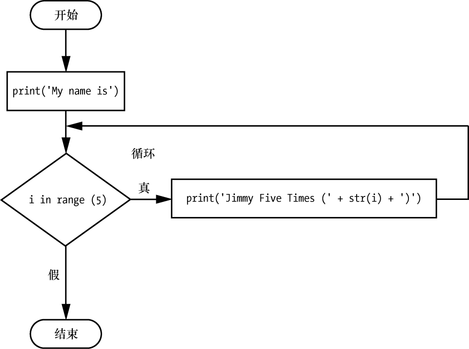

### 2.7.8　for循环和range()函数

在条件为 `True` 时， `while` 循环就会继续执行（这是它的名称的由来）。但如果你想让一个代码块执行固定次数，该怎么办？可以通过 `for` 循环语句和 `range()` 函数来实现。

在代码中， `for` 循环语句的形式为 `for i in range(5):` 总是包含以下部分。

+ `for` 关键字。
+ 一个变量名。
+ `in` 关键字。
+ 调用 `range()` 函数，最多传入3个参数。
+ 冒号。
+ 从下一行开始，缩进的代码块（称为 `for` 子句）。

让我们创建一个新的程序，命名为fiveTimes.py，看看 `for` 循环的效果：

```javascript
print('My name is')
for i in range(5):
    print('Jimmy Five Times (' + str(i) + ')')
```

可以在https://autbor.com/fivetimesfor/上查看该程序的执行情况。 `for` 循环子句中的代码运行了5次。第一次运行时，变量 `i` 被设为0，子句中的 `print()` 调用将输出 `Jimmy Five Times (0)` 。Python完成 `for` 循环子句内所有代码的一次迭代之后，执行将回到循环的顶部， `for` 循环语句让 `i` 增加1。这就是为什么 `range(5)` 导致子句进行了5次迭代， `i` 分别被设置为0、1、2、3、4。变量 `i` 将递增到（但不包括）传递给 `range()` 函数的整数。图2-13所示为fiveTimes.py程序的流程图。


<center class="my_markdown"><b class="my_markdown">图2-13　fiveTimes.py的流程图</b></center>

运行这个程序时，它将输出5次 `Jimmy Five Times` 和 `i` 的值，然后离开 `for` 循环：

```javascript
My name is
Jimmy Five Times (0)
Jimmy Five Times (1)
Jimmy Five Times (2)
Jimmy Five Times (3)
Jimmy Five Times (4)
```


**注意：**
也可以在循环中使用 `break` 和 `continue` 语句。 `continue` 语句将让 `for` 循环变量继续下一个值，就像程序执行已经到达循环的末尾并返回开始处一样。实际上，只能在 `while` 和 `for` 循环内部使用 `continue` 和 `break` 语句。如果试图在别处使用这些语句，Python将报错。


作为 `for` 循环的另一个例子，请考虑数学家高斯的故事。当高斯还是一个小孩时，有一次老师想给全班同学布置很多计算作业，于是让他们从0加到100。高斯想到了一个聪明办法，在几秒内算出了答案。你可以用 `for` 循环写一个Python程序，替他完成计算：

```javascript
❶ total = 0
❷ for num in range(101):
    ❸ total = total + num
❹ print(total)
```

结果应该是5050。程序刚开始时， `total` 变量被设为0❶。然后 `for` 循环❷执行100次 `total = total + num` ❸。当循环完成100次迭代时，0到100的每个整数都加给了 `total` 。这时， `total` 被输出到屏幕上❹。即使在最慢的计算机上，这个程序也不用1秒就能完成计算。

（小高斯想到，有50对数加起来是100：0+100，1 + 99, 2 + 98, 3 + 97，…，49 + 51。因为50 × 100是5000，再加上中间的50，所以0到100的所有数之和是5050。聪明的孩子！）

