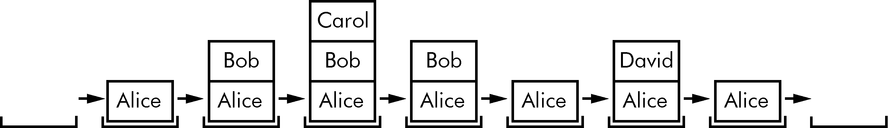
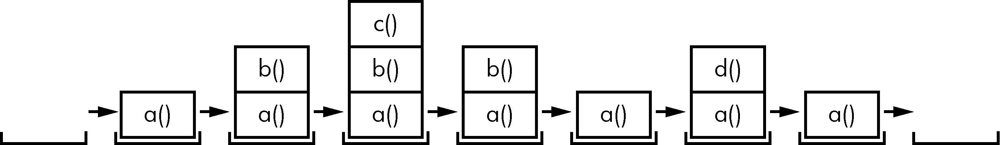

### 3.5　调用栈

想象一下你与某人聊天。你谈论你们的朋友Alice，然后让你想起关于同事Bob的故事，但首先你必须介绍一下表弟Carol的情况。你讲完了关于Carol的故事后，又回到谈论Bob的话题；当你讲完关于Bob的故事时，又回到了谈论Alice的话题。但是随后你想起了你的兄弟David的故事，因此你讲述了一个关于他的故事，然后回来完成最初有关Alice的故事。对话遵循类似栈的结构，如图3-1所示。对话类似于栈，当前主题始终位于栈的顶部。


<center class="my_markdown"><b class="my_markdown">图3-1　聊天对话栈</b></center>

与我们聊天对话类似，调用函数不会将执行过程单向发送到函数开始处。Python会记住哪行代码调用了该函数，以便程序执行在遇到 `return` 语句时可以返回那里。如果那个最初的函数又调用了其他函数，则执行将首先返回那些函数调用，然后再从最初的函数调用返回。

打开文件编辑器窗口，然后输入以下代码，并将它另存为abcdCallStack.py：

```javascript
def a():
    print('a() starts') 
  ❶ b()
  ❷ d()
    print('a() returns') 
def b():
    print('b() starts') 
  ❸ c()
    print('b() returns') 
def c():
  ❹ print('c()  starts') 
    print('c() returns') 
def d():
    print('d() starts') 
    print('d() returns') 
❺ a()
```

运行这个程序，输出结果会像下面这样：

```javascript
a() starts
b() starts
c() starts
c() returns
b() returns
d() starts
d() returns
a() returns
```

可以在https://autbor.com/abcdcallstack/上查看该程序的执行情况。当 `a()` 函数被调用时❺，它调用 `b()` 函数❶，后者又调用 `c()` 函数❸。 `c()` 函数不会调用任何东西；它只是显示 `c()` 函数开始❹和 `c()` 函数返回，再返回到 `b()` 函数中调用它的那一行❸。一旦执行返回到 `b()` 函数中调用 `c()` 函数的代码，它就会返回到 `a()` 函数中调用 `b()` 函数的行❶。执行继续到 `a()` 函数中的下一行❷，这是对 `d()` 函数的调用。像 `c()` 函数一样， `d()` 函数也不会调用任何东西。它只是显示 `d()` 函数开始和 `d()` 函数返回，然后返回到 `a()` 函数中调用它的行。由于 `d()` 函数不包含其他代码，因此执行返回到 `a()` 函数中调用 `d()` 函数的行❷。 `a()` 函数的最后一行显示 `a()` 函数返回，然后返回该程序末尾的最初对 `a()` 函数的调用❺。

“调用栈”是Python记住每个函数调用后在哪里返回执行的方式。调用栈不是存储在程序的变量中，而是由Python在后台处理它。当程序调用一个函数时，Python在调用栈的顶部创建一个“帧对象”。帧对象保存了最初函数调用的行号，使得Python可以记住返回的位置。如果进行了另一个函数调用，Python会将另一个帧对象放在调用栈中，且在前一个帧对象之上。

当函数调用返回时，Python从栈顶部删除一个帧对象，并将执行转移至保存在其中的行号。请注意，帧对象始终是从栈顶部添加和删除的，而不是从其他任意位置。图3-2所示为在调用和返回每个函数时，abcdCallStack.py中的调用栈的状态。


<center class="my_markdown"><b class="my_markdown">图3-2　调用栈的帧对象，随着abcdCallStack.py调用函数并从函数返回</b></center>

调用栈的顶部是执行当前所处的位置。当调用栈为空时，执行位于所有函数之外的一行上。

你不需要完全了解调用栈也能编写程序。理解函数调用返回到它们被调用的行号就足够了。但是，理解调用栈让你可以更容易理解局部和全局作用域，这将在下一节中介绍。

