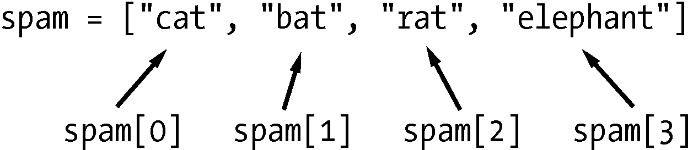

### 4.1.1　用索引取得列表中的单个值

假定列表 `['cat', 'bat', 'rat', 'elephant']` 保存在名为 `spam` 的变量中。 `spam[0]` 将求值为 `'cat'` ， `spam[1]` 将求值为 `'bat'` ，依此类推。变量名后面方括号内的整数被称为“索引”。列表中第一个值的索引是0，第二个值的索引是1，第三个值的索引是2，依此类推。图4-1所示为一个赋给 `spam` 变量的列表值，以及索引表达式的求值结果。请注意，因为第一个索引为0，所以最后一个索引比列表的大小少1︰4个数据项的列表的最后一个索引为3。


<center class="my_markdown"><b class="my_markdown">图4-1 一个列表值保存在spam变量中，展示了每个索引指向哪个值</b></center>

例如，在交互式环境中输入以下表达式。开始时将列表赋给变量 `spam` ：

```javascript
 >>> spam = ['cat', 'bat', 'rat', 'elephant']
 >>> spam[0]
  'cat'
 >>> spam[1]
  'bat'
 >>> spam[2]
  'rat'
 >>> spam[3]
  'elephant'
 >>> ['cat', 'bat', 'rat', 'elephant'][3]
  'elephant'
❶ >>> 'Hello, ' + spam[0]
❷ 'Hello, cat'
 >>> 'The ' + spam[1] + ' ate the ' + spam[0] + '.'
  'The bat ate the cat.'
```

请注意，表达式 `'Hello, ' + spam[0]`  ❶求值为 `'Hello, ' + 'cat'` ，因为 `spam[0]` 求值为字符串 `'cat'` 。这个表达式也因此求值为字符串 `'Hello, cat'` ❷。

如果使用的索引超出了列表中值的个数，Python将给出 `IndexError` 错误信息：

```javascript
>>> spam = ['cat', 'bat', 'rat', 'elephant']
>>> spam[10000]
Traceback (most recent call last):
  File "<pyshell#9>", line 1, in <module>
    spam[10000]
IndexError: list index out of range
```

索引只能是整数，不能是浮点数。下面的例子将导致 `TypeError` 错误：

```javascript
>>> spam = ['cat', 'bat', 'rat', 'elephant']
>>> spam[1]
'bat'
>>> spam[1.0]
Traceback (most recent call last):
  File "<pyshell#13>", line 1, in <module>
    spam[1.0]
TypeError: list indices must be integers or slices, not float
>>> spam[int(1.0)]
'bat'
```

列表也可以包含其他列表值。这些列表值中的值可以通过多重索引来访问，像这样：

```javascript
>>> spam = [['cat', 'bat'], [10, 20, 30, 40, 50]]
>>> spam[0]
['cat', 'bat']
>>> spam[0][1]
'bat'
>>> spam[1][4]
50
```

第一个索引表明使用哪个列表值，第二个索引表明该列表值中的值。例如， `spam[0][1]` 输出 `'bat'` ，即第一个列表中的第二个值。如果只使用一个索引，程序将输出该索引处的完整列表值。

