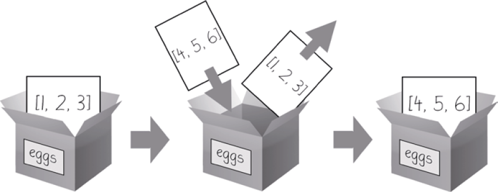
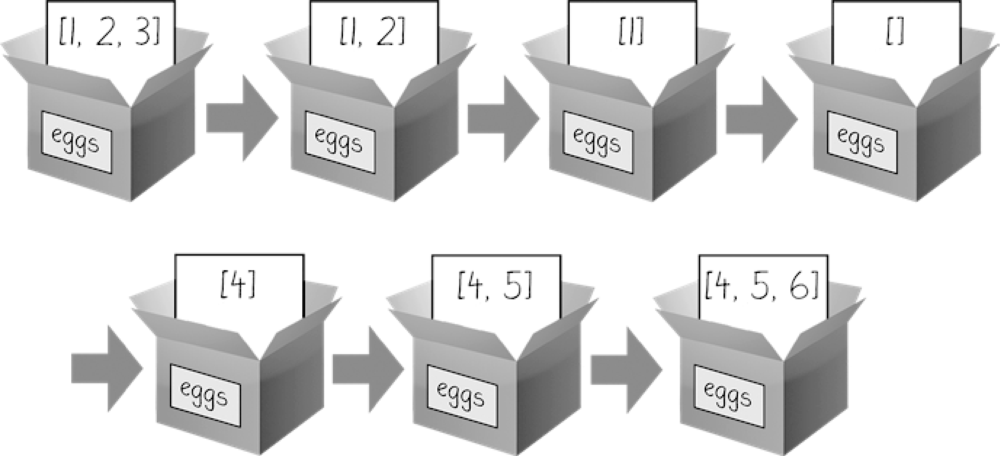

### 4.6.1　可变和不可变数据类型

列表和字符串在一个重要的方面是不同的。列表是“可变的”数据类型，它的值可以添加、删除或改变。但是，字符串是“不可变的”数据类型，它不能被更改。尝试对字符串中的一个字符重新赋值，将导致 `TypeError` 错误。在交互式环境中输入以下代码，你就会看到这个错误：

```javascript
>>> name = 'Zophie a cat'
>>> name[7] = 'the'
Traceback (most recent call last):
  File "<pyshell#50>", line 1, in <module>
    name[7] = 'the'
TypeError: 'str' object does not support item assignment
```

“改变”一个字符串的正确方式，是使用切片和连接构造一个“新的”字符串，从老的字符串那里复制一部分。在交互式环境中输入以下代码：

```javascript
>>> name = 'Zophie a cat'
>>> newName = name[0:7] + 'the' + name[8:12]
>>> name
'Zophie a cat'
>>> newName
'Zophie the cat'
```

我们用 `[0:7]` 和 `[8:12]` 来指定那些不想替换的字符。请注意，原来的 `'Zophie a cat'` 字符串没有被修改，因为字符串是不可变的。

尽管列表值是可变的，但下面代码中的第二行并没有修改列表 `eggs` ：

```javascript
>>> eggs = [1, 2, 3]
>>> eggs = [4, 5, 6]
>>> eggs
[4, 5, 6]
```

这里 `eggs` 中的列表值并没有改变，而是整个新的不同的列表值 `([4, 5, 6])` 覆写了老的列表值，如图4-2所示。


<center class="my_markdown"><b class="my_markdown">图4-2　当 `eggs = [4, 5, 6]` 被执行时， `eggs` 的内容被新的列表值取代</b></center>

如果你确实希望修改 `eggs` 中原来的列表，让它包含 `[4, 5, 6]` ，就要这样做：

```javascript
>>> eggs = [1, 2, 3]
>>> del eggs[2]
>>> del eggs[1]
>>> del eggs[0]
>>> eggs.append(4)
>>> eggs.append(5)
>>> eggs.append(6)
>>> eggs
[4, 5, 6]
```

这种情况下， `eggs` 最后的列表值与它开始的列表值是一样的。只是这个列表被改变了，而不是被覆写了。图4-3所示为上面交互式脚本的例子中，前7行代码所做的7次改动。

改变一个可变数据类型的值（就像前面例子中 `del` 语句和 `append()` 方法所做的事），就地改变了该值，因为该变量的值没有被一个新的列表值取代。

区分可变与不可变类型，似乎没有什么意义，但4.7.2小节“传递引用”将解释使用可变参数和不可变参数调用函数时产生的不同行为。首先，让我们来看看元组数据类型，它是列表数据类型的不可变形式。


<center class="my_markdown"><b class="my_markdown">图4-3　 `del` 语句和 `append()` 方法就地修改了同一个列表值</b></center>

