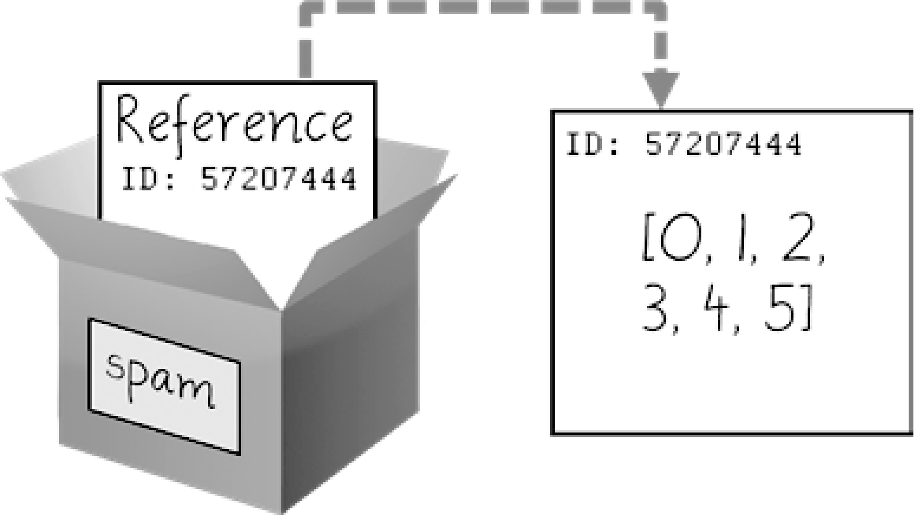
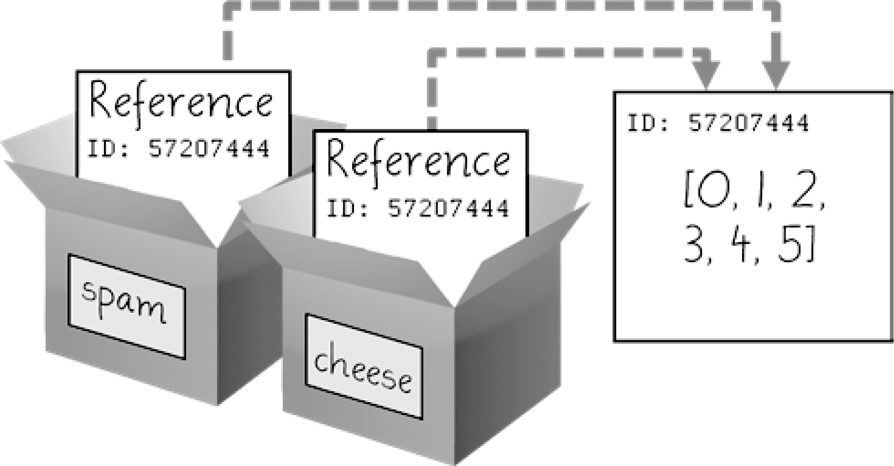

### 4.7　引用

正如你看到的，变量“保存”字符串和整数值。但是，这种解释只是简化了Python的实际操作。从技术上讲，变量存储的是对计算机内存位置的引用，这些位置存储了这些值。在交互式环境中输入以下代码：

```javascript
>>> spam = 42
>>> cheese = spam
>>> spam = 100
>>> spam
100
>>> cheese
42
```

将42赋给 `spam` 变量时，实际上是在计算机内存中创建值42，并将对它的“引用”存储在 `spam` 变量中。当你复制 `spam` 变量中的值，并将它赋给 `cheese` 变量时，实际上是在复制引用。 `spam` 和 `cheese` 变量均指向计算机内存中的值42。稍后将 `spam` 变量中的值更改为100时，你创建了一个新的值100，并将它的引用存储在 `spam` 变量中。这不会影响 `cheese` 变量的值。整数是“不变的”值，它们不会改变；更改 `spam` 变量实际上是让它引用内存中一个完全不同的值。

但列表不是这样的，因为列表值可以改变。也就是说，列表是“可变的”。这里有一些代码，让这种区别更容易理解。在交互式环境中输入以下代码：

```javascript
❶ >>> spam = [0, 1, 2, 3, 4, 5]
❷ >>> cheese = spam
❸ >>> cheese[1] = 'Hello!'
 >>> spam
   [0, 'Hello!', 2, 3, 4, 5]
 >>> cheese
   [0, 'Hello!', 2, 3, 4, 5]
```

这可能让你感到奇怪。代码只改变了 `cheese` 列表，但似乎 `cheese` 和 `spam` 列表同时发生了改变。

当创建列表时❶，你将对它的引用赋给了变量 `spam` 。但下一行❷只是将 `spam` 变量中的列表引用复制到 `cheese` 变量，而不是列表值本身。这意味着存储在 `spam` 和 `cheese` 变量中的值，现在指向了同一个列表。底下只有一个列表，因为列表本身实际从未复制。所以当你修改 `cheese` 变量的第一个元素时❸，也修改了 `spam` 变量指向的同一个列表。

记住，变量就像包含着值的盒子。本章前面的图显示列表在盒子中，这并不准确，因为列表变量实际上没有包含列表，而是包含对列表的“引用”（这些引用包含一些ID数字，Python在内部使用这些ID，但是你可以忽略）。利用盒子作为变量的隐喻，图4-4所示为列表被赋给 `spam` 变量时的情形。


<center class="my_markdown"><b class="my_markdown">图4-4  `spam = [0, 1, 2, 3, 4, 5]` 保存了对列表的引用，而非实际列表</b></center>

然后，图4-5所示的 `spam` 变量中的引用被复制给 `cheese` 变量。只有新的引用被创建并保存在 `cheese` 变量中，而非新的列表。请注意，两个引用都指向同一个列表。


<center class="my_markdown"><b class="my_markdown">图4-5　 `cheese =spam` 复制了引用，而非列表</b></center>

当你改变 `cheese` 变量指向的列表时， `spam` 变量指向的列表也发生了改变，因为 `cheese` 变量和 `spam` 变量都指向同一个列表，如图4-6所示。


<center class="my_markdown"><b class="my_markdown">图4-6　 `cheese[1] = 'Hello!'` 修改了两个变量指向的列表</b></center>

虽然Python变量在技术上包含的是对值的引用，但人们通常说，该变量包含了该值。

