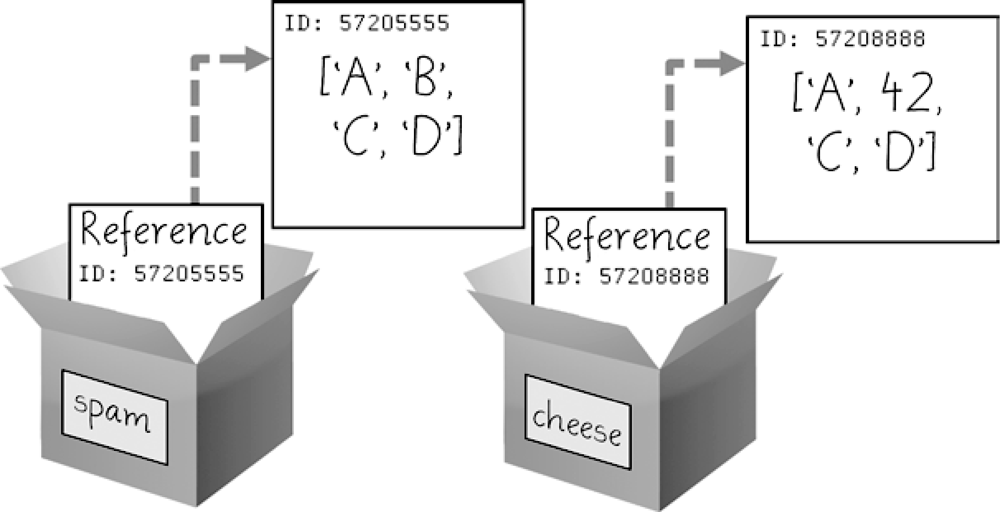

### 4.7.3　copy模块的copy()和deepcopy()函数

在处理列表和字典时，尽管传递引用常常是最方便的方法，但如果函数修改了传入的列表或字典，你可能不希望这些变动影响原来的列表或字典。要做到这一点，Python提供了名为 `copy` 的模块，其中包含 `copy()` 和 `deepcopy()` 函数。 `copy.copy()` 函数可以用来复制列表或字典这样的可变值，而不只是复制引用。在交互式环境中输入以下代码：

```javascript
>>> import copy
>>> spam = ['A', 'B', 'C', 'D']
>>> id(spam)
44684232
>>> cheese = copy.copy(spam)
>>> id(cheese) # cheese is a different list with different identity.
44685832
>>> cheese[1] = 42
>>> spam
['A', 'B', 'C', 'D']
>>> cheese
['A', 42, 'C', 'D']
```

现在 `spam` 和 `cheese` 变量指向独立的列表，这就是为什么当你将42赋给索引7时，只有 `cheese` 变量中的列表被改变。两个变量的引用ID数字不再一样，因为它们指向了独立的列表，如图4-7所示。


<center class="my_markdown"><b class="my_markdown">图4-7　 `cheese = copy.copy(spam)` 创建了第二个列表，能独立于第一个列表修改</b></center>

如果要复制的列表中包含了列表，那就使用 `copy.deepcopy()` 函数来代替。 `deepcopy()` 函数将同时复制它们内部的列表。

