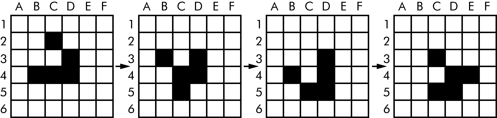

### 4.8　小程序：Conway的生命游戏

Conway的“生命游戏”是细胞自动机的一个例子：一组规则控制由离散细胞组成的区域的行为。在实践中，它会创建一个漂亮的动画以供观看。你可以用方块作为细胞在方格纸上绘制每个步骤。实心方块是“活的”，空心方块是“死的”。如果一个活的方块与两个或3个活的方块为邻，它在下一步将还是活的。如果一个死的方块正好有3个活的邻居，那么下一步它就会是活的。所有其他方块在下一步都会死亡或保持死亡。图4-8所示为几个步骤进展的示例。


<center class="my_markdown"><b class="my_markdown">图4-8　Conway的“生命游戏”模拟中的4步</b></center>

尽管规则很简单，但还是出现了许多令人惊讶的行为。Conway的“生命游戏”中的模式可以移动、自我复制甚至模仿CPU。但是，所有这些复杂、高级行为的基础，是一个相当简单的程序。

我们可以用列表的列表来表示二维的空间。内部列表表示方块的每一列，对于活的方块，存储一个'#'字符串；对于死的方块，存储一个' '空格字符串。在文件编辑器中输入以下源代码，并将文件另存为conway.py。如果你不太理解所有代码的工作原理，也没问题，只需输入它，然后按照这里提供的注释和说明进行操作即可：

```javascript
# Conway's Game  of Life 
import  random,  time,  copy
WIDTH = 60
HEIGHT  =  20
# Create a list of list for the cells: 
nextCells = []
for x in range(WIDTH):
    column = [] # Create a new column. 
    for y in range(HEIGHT):
        if random.randint(0, 1) == 0: 
             column.append('#') # Add a living cell.
        else:
             column.append(' ') # Add a dead cell.
    nextCells.append(column) # nextCells is a list of column lists.
while True: # Main program loop.
    print('\n\n\n\n\n')  #  Separate  each  step  with  newlines. 
    currentCells = copy.deepcopy(nextCells)
    #  Print  currentCells  on  the  screen: 
    for y in range(HEIGHT):
        for x in range(WIDTH):
            print(currentCells[x][y],  end='')  #  Print  the  #  or  space. 
        print() # Print a newline at the end of the row.
# Calculate the next step's cells  based on current step's cells: 
for x in range(WIDTH):
    for y in range(HEIGHT):
        # Get neighboring coordinates:
        # '%  WIDTH'  ensures leftCoord is always between 0 and WIDTH  - 1 
        leftCoord  = (x - 1) %  WIDTH
        rightCoord = (x + 1) % WIDTH
        aboveCoord = (y - 1) % HEIGHT
        belowCoord = (y + 1) % HEIGHT
        #  Count number of living neighbors:
        numNeighbors = 0
        if  currentCells[leftCoord][aboveCoord]   ==   '#': 
              numNeighbors += 1 # Top-left neighbor is alive.
        if  currentCells[x][aboveCoord]  ==  '#':
              numNeighbors += 1 # Top neighbor is alive.
        if  currentCells[rightCoord][aboveCoord]   ==   '#': 
              numNeighbors += 1 # Top-right neighbor is alive.
        if currentCells[leftCoord][y] == '#':
              numNeighbors += 1 # Left neighbor is alive.
        if currentCells[rightCoord][y] == '#':
              numNeighbors += 1 # Right neighbor is alive.
        if  currentCells[leftCoord][belowCoord]   ==   '#':
              numNeighbors += 1 # Bottom-left neighbor is alive.
        if  currentCells[x][belowCoord]  ==  '#':
              numNeighbors += 1 # Bottom neighbor is alive.
        if  currentCells[rightCoord][belowCoord]   ==   '#':
              numNeighbors += 1 # Bottom-right neighbor is alive.
        # Set cell based on Conway's Game of Life rules:
        if currentCells[x][y] == '#' and (numNeighbors == 2 or numNeighbors == 3):
             #  Living  cells  with  2  or  3  neighbors  stay  alive: 
             nextCells[x][y]  =  '#'
        elif currentCells[x][y] == ' ' and numNeighbors == 3:
             # Dead cells with 3 neighbors become alive: 
             nextCells[x][y]  =  '#'
        else:
             # Everything else dies or stays dead: 
             nextCells[x][y] = ''
    time.sleep(1) # Add a 1-second pause to reduce flickering.
```

让我们从头开始逐行查看这段代码。

```javascript
# Conway's Game  of Life
import  random,  time,  copy
WIDTH = 60
HEIGHT  =  20
```

首先，我们导入包含所需函数的模块，所需函数为 `random.randint()` 、 `time.sleep()` 和 `copy.deepcopy()` 函数。

```javascript
# Create a list of list for the cells: 
nextCells = []
for x in range(WIDTH):
    column = [] # Create a new column. 
    for y in range(HEIGHT):
        if random.randint(0, 1) == 0: 
             column.append('#') # Add a living cell.
        else:
             column.append(' ') # Add a dead cell. 
    nextCells.append(column) # nextCells is a list of column lists.
```

细胞自动机的第一步是完全随机的。我们需要创建一个列表的列表数据结构，来存储代表活细胞和死细胞的 `'＃'` 和 `' '` 字符串，它们在列表的列表中的位置反映了它们在屏幕上的位置。每个内部列表代表一列细胞。 `random.randint(0, 1)` 调用为细胞的活与死分别提供了平均50次的机会。

我们将列表的列表放在一个名为 `nextCells` 的变量中，因为在主程序循环中的第一步是将 `nextCells` 复制到 `currentCells` 中。对于我们的列表数据结构列表，x坐标从左侧的0开始，向右增加；而y坐标从顶部的0开始，向下增加。因此， `nextCells[0][0]` 将代表屏幕左上方的细胞，而 `nextCells[1][0]` 则代表该细胞右侧的细胞， `nextCells[0][1]` 代表其下方的细胞。

```javascript
while True: # Main program loop.
    print('\n\n\n\n\n')  #  Separate  each  step  with  newlines. 
    currentCells = copy.deepcopy(nextCells)
```

主程序循环的每次迭代就是细胞自动机的一步。在每一步中，我们都将 `nextCells` 复制到 `currentCells` ，在屏幕上输出 `currentCells` ，然后利用 `currentCells` 中的细胞来计算 `nextCells` 中的细胞。

```javascript
    #  Print  currentCells  on  the  screen: 
    for y in range(HEIGHT):
        for x in range(WIDTH):
            print(currentCells[x][y],  end='')  #  Print  the  #  or  space.
        print() # Print a newline at the end of the row.
```

这些嵌套的 `for` 循环可确保我们在屏幕上输出整行细胞，然后在该行的末尾添加换行符。我们对 `nextCells` 中的每一行重复这个操作。

```javascript
    # Calculate the next step's cells  based on current step's cells:
    for x in range(WIDTH):
        for y in range(HEIGHT):
            # Get neighboring coordinates:
            # '%  WIDTH'  ensures leftCoord is always between 0 and WIDTH  - 1
            leftCoord   = (x - 1) %  WIDTH
            rightCoord = (x + 1) % WIDTH
            aboveCoord = (y - 1) % HEIGHT
            belowCoord = (y + 1) % HEIGHT
```

接下来，我们要用两个嵌套的 `for` 循环来计算下一步的每个细胞。细胞的生死状态取决于邻居，因此我们首先计算当前x和y坐标在左、右、上、下的细胞索引。

%取模运算符实现了“环绕”。最左边的0列中的细胞，左邻居是 `0−1` ，即 `−1` 。要将它环绕到最右边一列的索引 `59` 上，我们计算 `(0 - 1) % WIDTH` 。由于 `WIDTH` 为 `60` ，因此该表达式的计算结果为 `59` 。这种取模环绕的技术也适用于右边、上边和下边的邻居。

```javascript
            #  Count  number  of  living  neighbors:
            numNeighbors = 0
            if currentCells[leftCoord][aboveCoord]   ==   '#':
                numNeighbors += 1 # Top-left neighbor is alive.
            if currentCells[x][aboveCoord]  ==  '#':
                numNeighbors += 1 # Top neighbor is alive.
            if currentCells[rightCoord][aboveCoord]   ==   '#':
                numNeighbors += 1 # Top-right neighbor is alive.
            if currentCells[leftCoord][y] == '#':
                numNeighbors += 1 # Left neighbor is alive.
            if currentCells[rightCoord][y] == '#':
                numNeighbors += 1 # Right neighbor is alive.
            if currentCells[leftCoord][belowCoord]   ==   '#': 
                numNeighbors += 1 # Bottom-left neighbor is alive.
            if currentCells[x][belowCoord]  ==  '#': 
                numNeighbors += 1 # Bottom neighbor is alive.
            if currentCells[rightCoord][belowCoord]   ==   '#':
                numNeighbors += 1 # Bottom-right neighbor is alive.
```

为了确定 `nextCells[x][y]` 上的细胞是存活还是死亡，我们需要计算 `currentCells[x][y]` 拥有的活邻居的数量。这一系列的 `if` 语句检查该细胞的8个邻居中的每个邻居，对于每个活邻居，向 `numNeighbors` 加1。

```javascript
            # Set cell based on Conway's Game of Life rules:
            if currentCells[x][y] == '#' and (numNeighbors == 2 or numNeighbors == 3):
                #  Living  cells  with  2  or  3  neighbors  stay  alive: 
                nextCells[x][y]  =  '#'
            elif currentCells[x][y] == ' ' and numNeighbors == 3:
                # Dead cells with 3 neighbors become alive: 
                nextCells[x][y]  =  '#'
            else:
                # Everything else dies or stays dead: 
                nextCells[x][y] = ' '
    time.sleep(1) # Add a 1-second pause to reduce flickering.
```

既然知道了 `currentCells[x][y]` 处细胞的活邻居数，我们可以将 `nextCells[x][y]` 设置为 `'＃'` 或 `' '` 。在遍历所有可能的x和y坐标之后，该程序将通过调用 `time.sleep(1)` 暂停1秒。然后，程序执行返回到主程序循环的开始处，以继续下一步。

人们已经发现了几种模式，例如“滑翔机”“螺旋桨”和“重量级飞船”。滑翔机模式每4步实现一次朝对角线方向的“移动”。你可以创建一个滑翔机，只要将conway.py程序中的以下行：

```javascript
    if random.randint(0, 1) == 0:
```

替换为：

```javascript
    if (x, y) in ((1, 0), (2, 1), (0, 2), (1, 2), (2, 2)):
```

通过搜索网络，你可以找到关于用Conway生命游戏生成的有趣模式的更多信息。你可以在GitHub的asweigart下的Python stdioGames上找到其他简短的、基于文本的Python程序，像这个程序一样。

