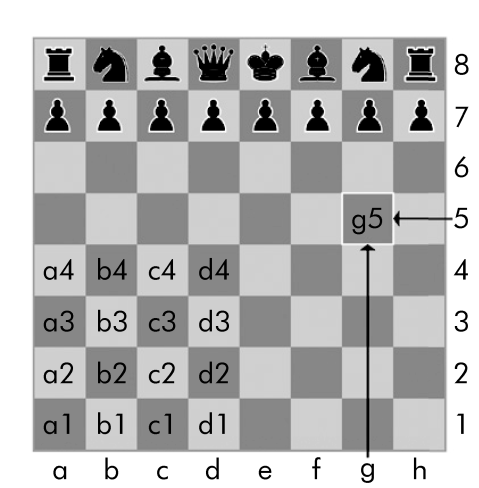
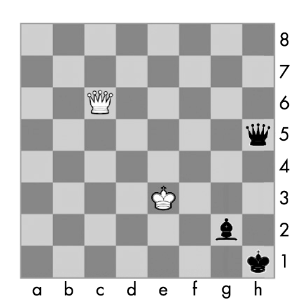

### 5.3　使用数据结构对真实世界建模

在因特网出现之前，人们也有办法与世界另一边的某人下一盘国际象棋。每个棋手在自己家里放好一个棋盘，然后轮流向对方寄出明信片，描述每一着棋。要做到这一点，棋手需要一种方法能无二义地描述棋盘的状态以及他们的着法。

在“代数记谱法”中，棋盘空间由数字和字母构成的坐标确定，如图5-1所示。

<b class="my_markdown">图5-1　代数记谱法中棋盘的坐标</b>

棋子用字母表示：K表示王，Q表示后，R表示车，B表示象，N表示马。要描述一次移动，可用棋子的字母和它的目的地坐标表示。一对这样的移动表示一个回合（白方先下），例如，棋谱2. Nf3 Nc6表明在棋局的第二回合，白方将马移动到f3，黑方将马移动到c6。

代数记谱法还有更多内容，要点是你可以用它无二义地描述国际象棋游戏，不需要站在棋盘前。你的对手甚至可以在世界的另一边。实际上，如果你的记忆力很好，甚至不需要使用物理的棋具：只需要阅读寄来的棋子移动信息，并更新心里想的棋盘。

计算机有很好的记忆力。现在计算机上的程序，很容易存储几百万个像'2. Nf3 Nc6'这样的字符串。这就是为什么计算机不用物理棋盘就能下国际象棋。它们用数据建模来表示棋盘，你可以编写代码来使用这个模型。

这里就可以用到列表和字典。例如，字典 `{'1h': 'bking', '6c':'queen','2g':'bishop', '5h': 'queen', '3e': 'waking'}` 可以表示图5-2所示的棋盘。

<b class="my_markdown">图5-2　用字典建模的棋盘 `{'1h': 'bking',`   `'6c': 'queen', '2g': 'bishop',`  `'5h': 'queen', '3e': 'waking'}`</b>

作为另一个例子，我们将使用比国际象棋简单一点的游戏：井字棋。

