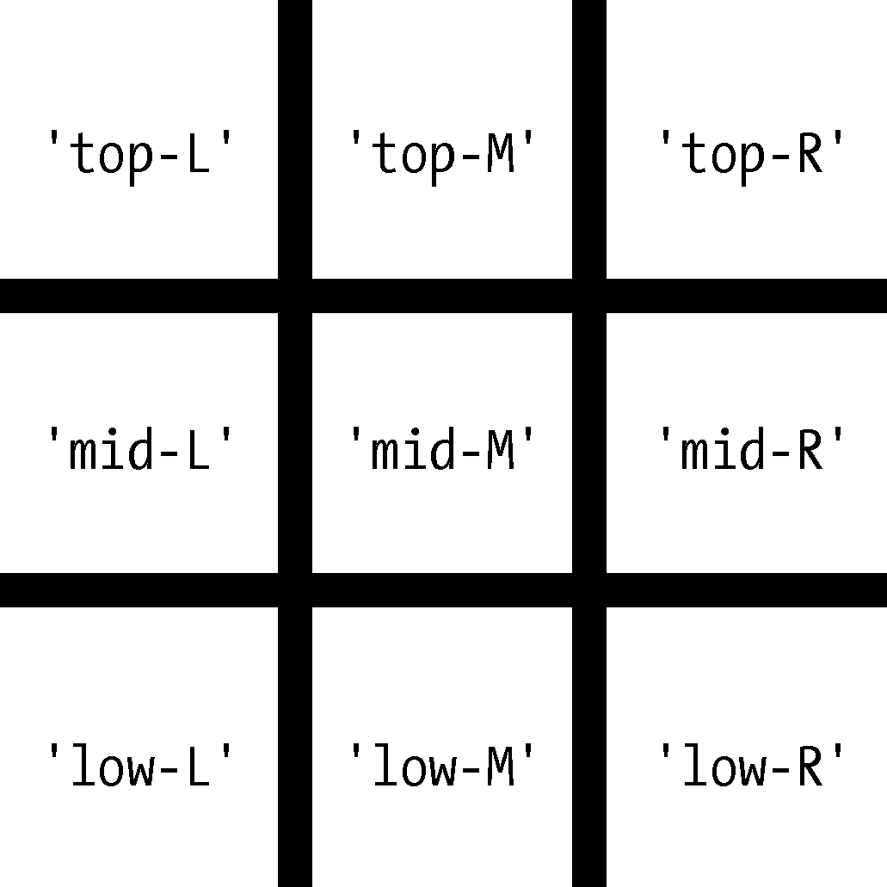
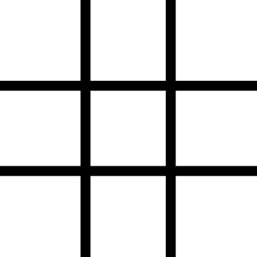
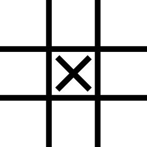
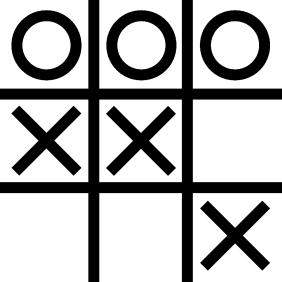

### 5.3.1　井字棋盘

井字棋盘看起来像一个大的井字符号（#），有9个空格，可以包含玩家 `X` 、玩家 `O` 或空格。要用字典表示井字棋盘，可以为每个格子分配一个字符串键，如图5-3所示。


<center class="my_markdown"><b class="my_markdown">图5-3　井字棋盘的格子和它们对应的键</b></center>

可以用字符串值来表示，棋盘上每个格子有 `'X'` 、 `'O'` 或 `' '` （空格字符）。因此，需要存储9个字符串。可以用一个字典来做这件事。带有键 `'top-R'` 的字符串表示右上角，带有键 `'low-L'` 的字符串表示左下角，带有键 `'mid-M'` 的字符串表示中间，以此类推。

这个字典就是表示井字棋盘的数据结构。将这个字典表示的井字棋盘保存在名为 `theBoard` 的变量中。打开一个文件编辑器窗口，输入以下代码，并保存为ticTacToe.py：

```javascript
theBoard = {'top-L': ' ', 'top-M': ' ', 'top-R': ' ',
            'mid-L': ' ', 'mid-M': ' ', 'mid-R': ' ',
            'low-L': ' ', 'low-M': ' ', 'low-R': ' '}
```

保存在 `theBoard` 变量中的数据结构表示了图5-4所示的井字棋盘。


<center class="my_markdown"><b class="my_markdown">图5-4　一个空的井字棋盘</b></center>

因为 `theBoard` 变量中每个键的值都是单个空格字符，所以这个字典表示一个完全干净的棋盘。如果玩家 `X` 选择了中间的空格，就可以用下面这个字典来表示棋盘：

```javascript
theBoard = {'top-L': ' ', 'top-M': ' ', 'top-R': ' ',
            'mid-L': ' ', 'mid-M': 'X', 'mid-R': ' ',
            'low-L': ' ', 'low-M': ' ', 'low-R': ' '}
```

`theBoard` 变量中的数据结构现在表示图5-5所示的井字棋盘。


<center class="my_markdown"><b class="my_markdown">图5-5　第一着</b></center>

在玩家 `O` 获胜的棋盘中， `O` 会横贯棋盘的顶部：

```javascript
theBoard = {'top-L': 'O', 'top-M': 'O', 'top-R': 'O',
            'mid-L': 'X', 'mid-M': 'X', 'mid-R': ' ',
            'low-L': ' ', 'low-M': ' ', 'low-R': 'X'}
```

`theBoard` 变量中的数据结构现在表示图5-6所示的井字棋盘。


<center class="my_markdown"><b class="my_markdown">图5-6　玩家 `O` 获胜</b></center>

当然，玩家只看到输出在屏幕上的内容，而不是变量的内容。让我们创建一个函数，将棋盘字典输出到屏幕上。将下面代码添加到ticTacToe.py（新代码是黑体的）：

```javascript
theBoard = {'top-L': ' ', 'top-M': ' ', 'top-R': ' ',
            'mid-L': ' ', 'mid-M': ' ', 'mid-R': ' ',
            'low-L': ' ', 'low-M': ' ', 'low-R': ' '}
def printBoard(board):
 print(board['top-L'] + '|' + board['top-M'] + '|' + board['top-R'])
 print('-+-+-')
 print(board['mid-L'] + '|' + board['mid-M'] + '|' + board['mid-R'])
 print('-+-+-')
 print(board['low-L'] + '|' + board['low-M'] + '|' + board['low-R'])
printBoard(theBoard)
```

可以在https://autbor.com/tictactoe1/上查看该程序的执行情况。运行这个程序时， `printBoard()` 函数将输出空白井字棋盘：

```javascript
| |
-+-+-
| |
-+-+-
| |
```

`printBoard()` 函数可以处理传入的任何井字棋盘数据结构。尝试将代码改成以下的样子：

```javascript
theBoard = {'top-L': 'O', 'top-M': 'O', 'top-R': 'O', 'mid-L': 'X', 'mid-M':
'X', 'mid-R': ' ', 'low-L': ' ', 'low-M': ' ', 'low-R': 'X'}
def printBoard(board):
 print(board['top-L'] + '|' + board['top-M'] + '|' + board['top-R'])
 print('-+-+-')
 print(board['mid-L'] + '|' + board['mid-M'] + '|' + board['mid-R'])
 print('-+-+-')
 print(board['low-L'] + '|' + board['low-M'] + '|' + board['low-R'])
printBoard(theBoard)
```

可以在https://autbor.com/tictactoe2/上查看该程序的执行情况。现在运行该程序，新棋盘将输出在屏幕上：

```javascript
O|O|O
-+-+-
X|X|
-+-+-
| |X
```

因为你创建了一个数据结构来表示井字棋盘，并编写了 `printBoard()` 函数来解释该数据结构，所以就有了一个程序来对井字棋盘进行 “建模”。也可以用不同的方式组织数据结构（例如，使用 `'TOP-LEFT'` 这样的键来代替 `'top-L'` ）。只要代码能处理你的数据结构，那么该程序就能正确工作。

例如，使用 `printBoard()` 函数的前提是井字棋盘数据结构是一个字典，并包含全部的9个格子中的键。假如传入的字典缺少 `'mid-L'` 键，程序就不能工作了：

```javascript
O|O|O
-+-+-
Traceback (most recent call last):
  File "ticTacToe.py", line 10, in <module>
    printBoard(theBoard)
  File "ticTacToe.py", line 6, in printBoard
    print(board['mid-L'] + '|' + board['mid-M'] + '|' + board['mid-R'])
KeyError: 'mid-L'
```

现在让我们添加代码，允许玩家输入他们的着法。修改ticTacToe.py程序，如下所示：

```javascript
theBoard = {'top-L': ' ', 'top-M': ' ', 'top-R': ' ', 'mid-L': ' ', 'mid-M': '
', 'mid-R': ' ', 'low-L': ' ', 'low-M': ' ', 'low-R': ' '}
def printBoard(board):
    print(board['top-L'] + '|' + board['top-M'] + '|' + board['top-R'])
    print('-+-+-')
    print(board['mid-L'] + '|' + board['mid-M'] + '|' + board['mid-R'])
    print('-+-+-')
    print(board['low-L'] + '|' + board['low-M'] + '|' + board['low-R'])
turn = 'X'
for i in range(9):
 ❶ printBoard(theBoard)
 print('Turn for ' + turn + '. Move on which space?')
 ❷ move = input()
 ❸ theBoard[move] = turn
 ❹ if turn == 'X':
 turn = 'O'
 else:
 turn = 'X'
printBoard(theBoard)
```

可以在https://autbor.com/tictactoe3/上查看该程序的执行情况。新的代码在每一步新的着法之前，输出棋盘❶，获取当前棋手的着法❷，并相应地更新棋盘❸。然后改变当前棋手❹，进入下一着。

运行该程序，它看起来像这样：

```javascript
 | |
-+-+-
 | |
-+-+-
 | |
Turn for X. Move on which space?
mid-M
 | |
-+-+-
 |X|
-+-+-
 | |
--snip--
O|O|X
-+-+-
X|X|O
-+-+-
O| |X
Turn for X. Move on which space?
low-M
O|O|X
-+-+-
X|X|O
-+-+-
O|X|X
```

这不是一个完整的井字棋游戏（例如，它并不检查玩家是否获胜），但这已足够展示如何在程序中使用数据结构。


**注意：**
如果你很好奇，完整的井字棋程序的源代码可以在网上找到。


