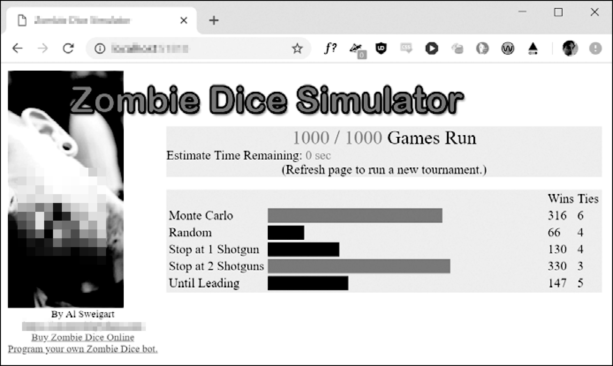

### 6.11.2　僵尸骰子机器人

“编程游戏”是一种游戏类型，玩家无须直接玩游戏，而是编写机器人程序来自主玩游戏。我创建了一个“僵尸骰子”模拟器，该程序可以让程序员在制作游戏AI时练习技能。僵尸骰子机器人可以很简单，也可以非常复杂，非常适合课堂练习或个人编程挑战。

僵尸骰子是Steve Jackson游戏公司提供的一款快速、有趣的骰子游戏。玩家是僵尸，他们试图尽可能多地吃掉人类的大脑，而不被击中3枪。杯子里有13个骰子，大脑、足迹和霰弹枪的图标贴在它们的面上。骰子图标带有颜色，每种颜色代表发生每种事件的可能性。每个骰子都有两个侧面是足迹，带有绿色图标的骰子表示有更多的大脑侧面，带有红色图标的骰子表示有更多的霰弹枪侧面，而带有黄色图标的骰子则有同样多的大脑和霰弹枪。每个玩家轮流执行以下操作。

1．将13个骰子放入杯子中。玩家从杯子中随机抽取3个骰子，然后掷骰子。玩家总是正好掷3个骰子。

2．将它们分开，数数大脑（被吃掉了大脑的人）和霰弹枪（反击的人）。累积3把霰弹枪会自动以零分结束玩家的这一轮（无论他们有多少大脑）。如果他们有0～2把霰弹枪，就可以根据需要继续掷骰子。他们还可以选择结束这一轮，每个大脑算一个积分。

3．如果玩家决定继续掷骰子，则必须重新掷所有带足迹的骰子。请记住，玩家必须总是掷3个骰子。如果他们没有3个带足迹的骰子来掷，就必须从杯子中抽取更多骰子。玩家可能会继续掷骰子，直到他们得到3把霰弹枪（使所有物品丢失），或13个骰子都被掷出为止。玩家可能不会只重掷一个或两个骰子，也不会在重掷过程中停止。

4．当某人达到13个大脑时，其余玩家也完成了这一局。大脑最多的玩家会赢。如果出现平局，平局的玩家将进行最后一局决胜局。

僵尸骰子具有“得寸进尺”的游戏机制：掷骰子的次数越多，你能获得的大脑就越多，但也越可能遇到3把霰弹枪而失去一切。一旦某个玩家达到13分，其余的玩家还有一轮（有可能追赶），游戏结束。得分最高的玩家获胜。你可以在GitHub中搜索asweigart/zombiedice来找到完整的规则。

按照附录A中的说明，通过pip安装 `zombiedice` 模块。你可以通过在交互式环境中运行以下命令以利用某些预置的机器人运行模拟器来演示：

>>>   **import  zombiedice** &#13;
>>>   **zombiedice.demo()** &#13;
Zombie Dice Visualization is running. Open your browser to http://&#13;
localhost:51810  to  view  ** ** it.&#13;
Press Ctrl-C to quit.

该程序将启动你的Web浏览器，如图6-1所示。

你将编写一个带有 `turn()` 方法的类来创建机器人，该方法在轮到掷骰子时会被模拟器调用。类超出了本书的范围，因此已经在myZombie.py程序中为你设置了类代码，该程序位于本书的可下载ZIP文件中。编写方法本质上与编写函数相同，并且你可以将myZombie.py程序中的 `turn()` 代码用作模板。在这个 `turn()` 方法中，你可以根据希望机器人掷骰子的次数，调用 `zombiedice.roll()` 函数。


<center class="my_markdown"><b class="my_markdown">图6-1　僵尸骰子模拟器的Web GUI</b></center>

程序代码如下：

```javascript
import zombiedice
class MyZombie:
   def  _init_ (self, name):
      # All zombies must have a name: 
      self.name =  name
   def  turn(self,  gameState):
   # gameState is a dict with info about the current state of the game.
   # You can choose to ignore it in your code.
   diceRollResults = zombiedice.roll() # first roll
   # roll() returns a dictionary with keys 'brains', 'shotgun', and
   # 'footsteps' with how many rolls of each type there were.
   # The 'rolls' key is a list of (color, icon) tuples with the
   # exact roll result information.
   # Example of a roll() return value:
   # {'brains': 1, 'footsteps': 1, 'shotgun': 1,
   #   'rolls': [('yellow', 'brains'), ('red', 'footsteps'),
   #            ('green','shotgun')]}
    #  REPLACE  THIS  ZOMBIE  CODE  WITH  YOUR  OWN:
    brains = 0
    while diceRollResults is not None:
        brains += diceRollResults['brains']
         if brains  <  2:
              diceRollResults = zombiedice.roll() # roll again 
         else:
              break
zombies = (
    zombiedice.examples.RandomCoinFlipZombie(name='Random'),
    zombiedice.examples.RollsUntilInTheLeadZombie(name='Until Leading'),
    zombiedice.examples.MinNumShotgunsThenStopsZombie(name='Stop at 2
Shotguns', minShotguns=2), 
    zombiedice.examples.MinNumShotgunsThenStopsZombie(name='Stop at 1
Shotgun', minShotguns=1), 
    MyZombie(name='My Zombie Bot'),
    # Add any other zombie players here.
)
# Uncomment one of the following lines to run in CLI or Web GUI mode:
#zombiedice.runTournament(zombies=zombies, numGames=1000)
zombiedice.runWebGui(zombies=zombies,  numGames=1000)
```

`turn()` 方法接收两个参数： `self` 和 `gameState` 。你可以在最初的几个僵尸机器人中忽略这些，如果想了解更多，可以查阅在线文档以获取详细信息。 `turn()` 方法针对初始掷骰子应至少调用一次 `zombiedice.roll()` 。然后，根据机器人采用的策略，它可以多次调用 `zombiedice.roll()` 。在 `myZombie.py` 中， `turn()` 方法调用 `zombiedice.roll()` 两次，这意味着无论掷骰子的结果如何，僵尸机器人总是会每轮掷两次骰子。

`zombiedice.roll()` 的返回值告诉掷骰子的结果。它是一个字典，有4个键。其中的3个键 `'shotgun'` 、 `'brains'` 和 `'footsteps'` 的整数值表示产生这些图标的骰子有几个。第4个 `'rolls'` 键有一个值，是每次掷骰子的元组列表。这些元组包含两个字符串：骰子的颜色在索引0处，掷出的图标在索引1处。请将 `turn()` 方法定义中的代码注释作为例子。如果该机器人已经掷出了 3 把霰弹枪，那么 `zombiedice.roll()` 将返回 `None` 。

尝试自己编写一些机器人来玩此游戏，看看它们与其他机器人相比如何。具体来说，请尝试创建以下机器人。

+ 在第一掷之后会随机决定继续还是停止的机器人。
+ 在掷出两个大脑后停止掷骰子的机器人。
+ 在掷出两把霰弹枪后停止掷骰子的机器人。
+ 开始就决定将骰子掷1～４次的机器人，但如果掷出两把霰弹枪，它将提前停止。
+ 掷出的霰弹枪多于大脑后停止掷骰子的机器人。

通过模拟器运行这些机器人，并观察它们之间的比较结果，你还可以在GitHub搜索asweigart/zombiedice来查看一些预置机器人的代码。如果你碰巧在现实世界中玩这个游戏，那么你将受益于成千上万次游戏，这些经验会告诉你，最好的策略之一是一旦掷出两把霰弹枪就停止。但是，你总是可以得寸进尺。


