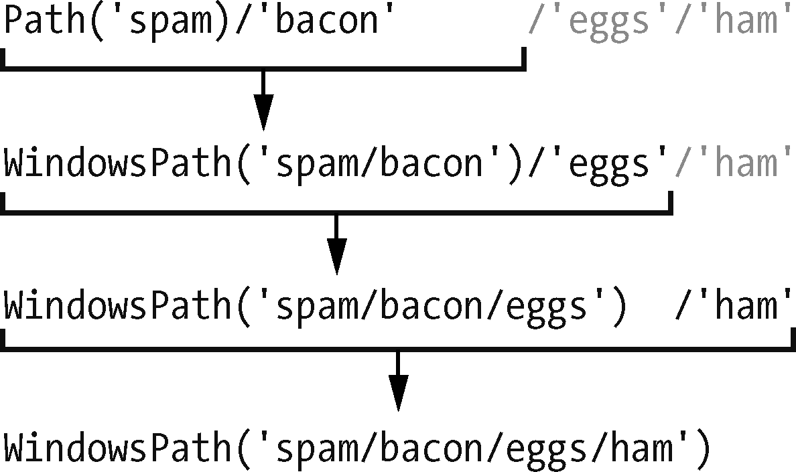

### 9.1.2　使用/运算符连接路径

通常，我们用+运算符将两个整数或浮点数相加，例如在表达式2 + 2中，其结果为整数值4。但是我们也可以用+运算符将两个字符串值连接起来，例如表达式 `'Hello'+'World'` ，其计算结果为字符串值 `'HelloWorld'` 。同样，我们通常用作除法的/运算符也可以组合 `Path` 对象和字符串。当你使用 `Path()` 函数创建路径对象后，这一点对修改路径对象很有帮助。

例如，在交互式环境中输入以下内容：

```javascript
>>> from pathlib import Path
>>> Path('spam') /'bacon' / 'eggs'
WindowsPath('spam/bacon/eggs')
>>> Path('spam') / Path('bacon/eggs')
WindowsPath('spam/bacon/eggs')
>>> Path('spam') / Path('bacon', 'eggs')
WindowsPath('spam/bacon/eggs')
```

将/运算符与 `Path` 对象一起使用，连接路径就像连接字符串一样容易。与使用字符串连接或 `join()` 方法相比，这个方法也更安全，如以下示例：

```javascript
>>> homeFolder = r'C:\Users\Al'
>>> subFolder = 'spam'
>>> homeFolder + '\\' + subFolder
'C:\\Users\\Al\\spam'
>>> '\\'.join([homeFolder, subFolder])
'C:\\Users\\Al\\spam'
```

使用这段代码的脚本并不安全，因为其中的倒斜杠仅适用于Windows操作系统。你可以添加一条 `if` 语句来检查 `sys.platform` （它包含一个字符串，描述了计算机的操作系统），从而决定要使用哪种斜杠，但是在所有需要的地方应用这段自定义代码的结果可能会不一致，而且容易出错。

无论你的代码运行在什么操作系统上， `pathlib` 模块都可以重新使用/数学运算符正确地连接路径，从而解决这些问题。下面的示例利用这种策略来连接同一个路径：

```javascript
>>> homeFolder = Path('C:/Users/Al')
>>> subFolder = Path('spam')
>>> homeFolder / subFolder
WindowsPath('C:/Users/Al/spam')
>>> str(homeFolder / subFolder)
'C:\\Users\\Al\\spam'
```

使用/运算符连接路径时，唯一需要记住的是，前两个值中有一个必须是 `Path` 对象。

如果尝试在交互式环境中输入以下内容，Python会报错：

```javascript
>>> 'spam' / 'bacon' / 'eggs'
Traceback (most recent call last):
  File "<stdin>", line 1, in <module>
TypeError: unsupported operand type(s) for /: 'str' and 'str'
```

Python从左到右求值/运算符，并求值为一个 `Path` 对象，因此最左边第一个或第二个值必须是 `Path` 对象，整个表达式才能求值为 `Path` 对象。下面是/运算符和 `Path` 对象求值为最终的 `Path` 对象的方式。


如果看到前面显示的 `TypeError: unsupported operand type(s) for /: 'str' and 'str'` 错误信息，就需要在表达式的左侧放一个 `Path` 对象。

/运算符替换了较旧的 `os.path.join()` 函数，可以从Python的官方网站中了解更多信息。

