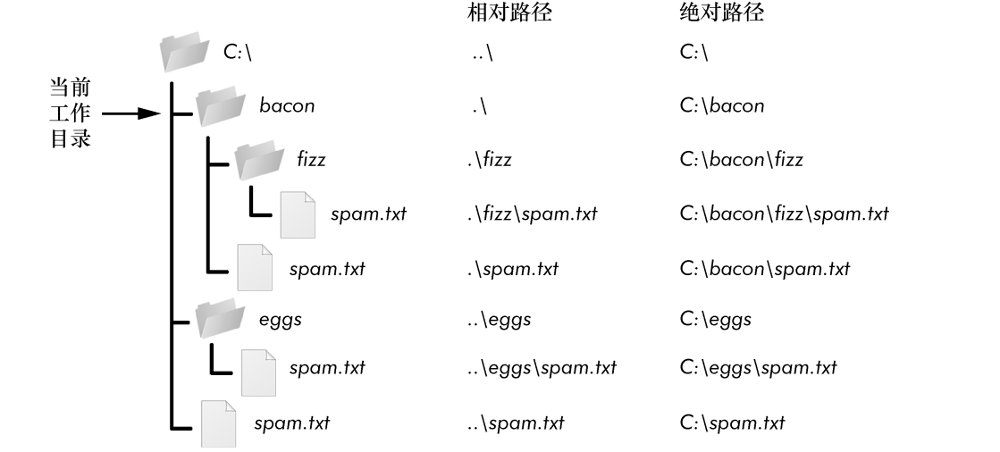

### 9.1.5　绝对路径与相对路径

有以下两种方法可指定一个文件路径。

+ “绝对路径”，总是从根文件夹开始。
+ “相对路径”，相对于程序的当前工作目录。

还有“点”（.）和“点点”（..）文件夹。它们不是真正的文件夹，而是可以在路径中使用的特殊名称。单个的句点（“点”）用作文件夹名称时，是“这个目录”的缩写。两个句点（“点点”）的意思是父文件夹。

图9-2所示为一些文件夹和文件的例子。如果当前工作目录设置为C:\bacon，那么这些文件夹和文件的相对目录就设置为图9-2所示的样子。

<b class="my_markdown">图9-2　在工作目录C:\bacon中的文件夹和文件的相对路径</b>

相对路径开始处的.\是可选的。例如，.\spam.txt和spam.txt指的是同一个文件。

