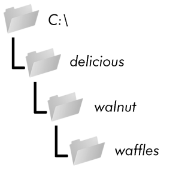

### 9.1.6　用os.makedirs()创建新文件夹

程序可以用 `os.makedirs()` 函数创建新文件夹（目录）。在交互式环境中输入以下代码：

```javascript
>>> import os
>>> os.makedirs('C:\\delicious\\walnut\\waffles')
```

这不仅将创建C:\delicious文件夹，也会在C:\delicious下创建walnut文件夹，并在C:\delicious\
walnut中创建waffles文件夹。也就是说， `os.makedirs()` 将创建所有必要的中间文件夹，目的是确保完整路径名存在。图9-3所示为这个文件夹的层次结构。


<center class="my_markdown"><b class="my_markdown">图9-3　 `os.makedirs('C:\\delicious\\walnut\\waffles')` 的结果</b></center>

要通过 `Path` 对象创建目录，请调用 `mkdir()` 方法。例如，以下代码将在我的计算机的主文件夹下创建一个spam文件夹：

```javascript
>>> from pathlib import Path
>>> Path(r'C:\Users\Al\spam').mkdir()
```

注意， `mkdir()` 一次只能创建一个目录。它不会像 `os.makedirs()` 一样同时创建多个子目录。

