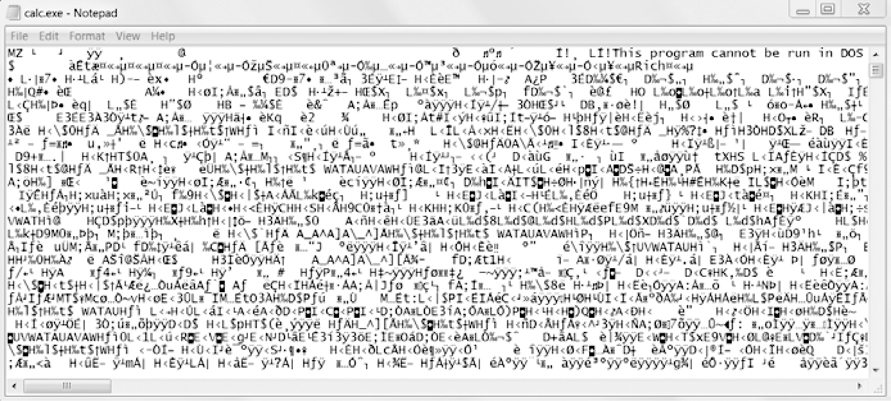

### 9.2　文件读写过程

在熟悉了处理文件夹和相对路径的方法后，你就可以指定文件的位置，从而进行读写。接下来几小节介绍的函数适用于纯文本文件。“纯文本文件”只包含基本文本字符，不包含字体、大小和颜色信息。带有 `.txt` 扩展名的文本文件，以及带有 `.py` 扩展名的Python脚本文件，都是纯文本文件的例子。它们可以被Windows操作系统的 `Notepad` 或 `macOS` 的 `TextEdit` 应用打开。你的程序可以轻易地读取纯文本文件的内容，将它们作为普通的字符串值。

“二进制文件”包含所有其他文件类型，如字处理文档、PDF、图像、电子表格和可执行程序。如果用 `Notepad` 或 `TextEdit` 打开一个二进制文件，它看起来就像乱码，如图9-6所示。


<center class="my_markdown"><b class="my_markdown">图9-6　在 `Notepad` 中打开Windows操作系统的 `calc.exe` 程序</b></center>

因为每种不同类型的二进制文件都必须用它自己的方式来处理，所以本书不会探讨直接读写二进制文件。好在Python的许多模块让二进制文件的处理变得更容易。在本章稍后，你将探索其中一个模块： `shelve` 。 `pathlib` 模块的 `read_text()` 方法返回文本文件全部内容的字符串。它的 `write_text()` 方法利用传递给它的字符串创建一个新的文本文件（或覆盖现有文件）。在交互式环境中输入以下内容：

```javascript
>>> from pathlib import Path
>>> p = Path('spam.txt')
>>> p.write_text('Hello, world!')
13
>>> p.read_text()
'Hello, world!'
```

这些方法将创建一个内容为 `'Hello, world!'` 的 `spam.txt` 文件。  `write_text()` 返回的13表示已将13个字符写入文件。（通常可以忽略此信息。） `read_text()` 方法以字符串形式读取并返回新文件的内容： `'Hello, world!'` 。

请记住，这些 `Path` 对象方法仅提供与文件的基本交互。写入文件的更常见方式涉及使用 `open()` 函数和文件对象。在Python中，读写文件有以下3个步骤。

1．调用 `open()` 函数，返回一个 `File` 对象。

2．调用 `File` 对象的 `read()` 或 `write()` 方法。

3．调用 `File` 对象的 `close()` 方法，关闭该文件。

我们将在以下各小节中介绍这些步骤。

