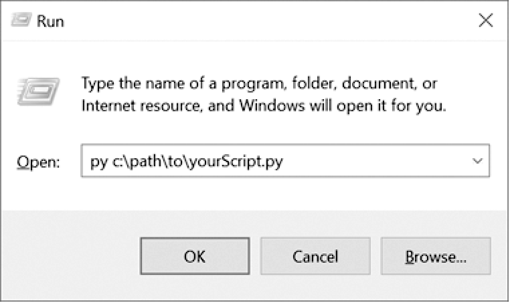

### B.2　在Windows操作系统上运行Python程序

还有一些其他的方法可以在Windows操作系统上运行Python程序。你可以不打开命令行窗口来运行 ` `Python` ` 脚本，而是按win-R快捷键来打开“运行”对话框，然后输入 ` `py C:\path\to\your\ pythonScript.py` ` ，如图B-1所示。py.exe程序安装在C:\Windows\py.exe，它已经在 ` `PATH` ` 环境变量中，运行程序时.exe扩展名是可省略的。


<center class="my_markdown"><b class="my_markdown">图B-1　Windows操作系统上的“运行”对话框</b></center>

这种方法的缺点是，你必须输入脚本的完整路径。另外，虽然从对话框中运行你的Python脚本会打开一个新的命令行窗口来显示它的输出，但当程序结束时，这个窗口会自动关闭，你可能会错过一些输出。

你可以通过创建一个批处理脚本来解决这些问题，批处理脚本是一个带有.bat文件扩展名的小文本文件，可以运行多个命令行命令，很像macOS和Linux操作系统中的shell脚本。你可以使用记事本等文本编辑器来创建这些文件。

要创建一个批处理文件，请创建一个新的文本文件，其中包含一行文字，就像这样：

```javascript
@py.exe C:\path\to\your\pythonScript.py %*
@pause
```

用你自己的程序的绝对路径替换这个路径，并以.bat作为扩展名保存这个文件（例如pythonScript.bat）。每个命令开头的 ` `@` ` 号可以防止它在命令行窗口中显示，而 ` `%*` ` 则将在批处理文件名之后输入的所有命令行参数转发到Python脚本中。而 Python脚本则会读取 ` `sys.argv` ` 列表中的命令行参数。这个批处理文件让你不必每次运行Python程序时都输入完整的绝对路径。此外， ` `@pause` ` 会在Python脚本结束后添加“ ` `Press any key to continue...` ` ”，以防止程序窗口过快消失。建议将所有的批处理文件和.py文件放在一个已经在PATH环境变量中的文件夹中，例如C:\Users\<USERNAME>。

如果你设置了一个批处理文件来运行Python脚本，就不需要打开一个命令行窗口来输入完整的文件路径和Python脚本的名字。相反，只需按win-R快捷键，输入  ` `pythonScript` ` （不需要完整的pythonScript.bat名称），然后按回车键运行你的脚本。

