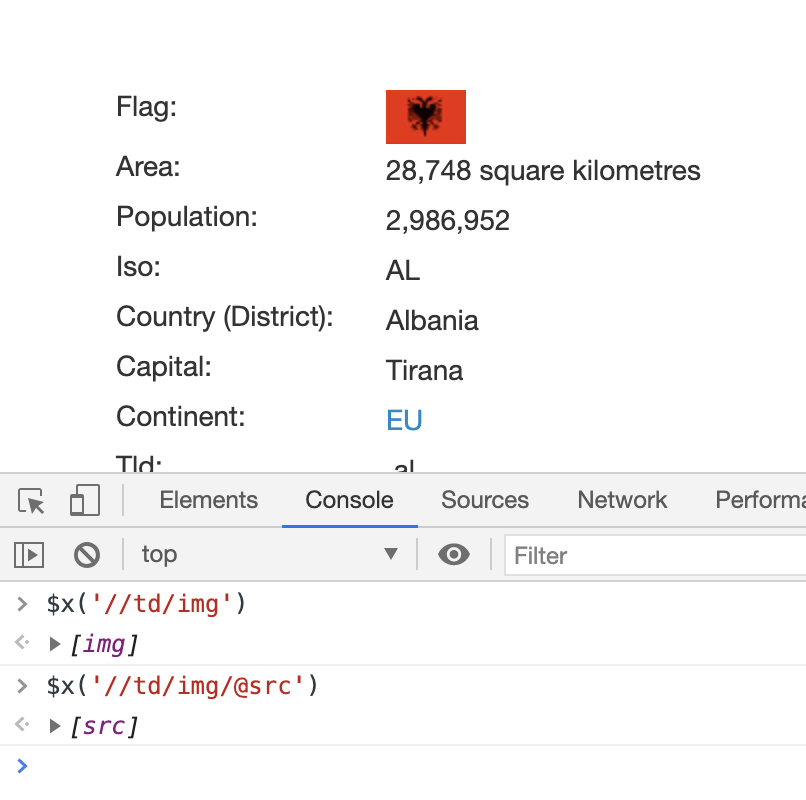

有时候使用 CSS 选择器无法正常工作，尤其是在 HTML 非常不完整或存在格式不当的元素时。在这些情况下，XPath 可以帮助你基于页面中的层次结构关系构建非常明确的选择器。

XPath 遵循一些基本的语法规则，并且和 CSS 选择器有些相似。下表所示为这两种方式的一些快速参考。

| 选择器描述                             | xPath选择器                          | CSS选择器            |
| -------------------------------------- | ------------------------------------ | -------------------- |
| 选择所有链接                           | '//a'                                | 'a'                  |
| 选择类名为 "main" 的 div 元素          | '//div[@class="main"]'               | 'div.main'           |
| 选择 ID 为 "list" 的 ul 元素           | '//ul[@id="list"]'                   | 'ul#list'            |
| 从所有段落中选择文本                   | '//p/text()'                         | 'p'*                 |
| 选择所有类名中包含 'test' 的 div 元素  | '//div[contains(@class, 'test')]'    | 'div[class*="test"]' |
| 选择所有包含链接或列表的 div 元素      | '//div[a\|ul]'                       | 'div a, div ul'      |
| 选择 href 属性中包含 google.com 的链接 | '//a[contains(@href, "google.com")]' | 'a'*                 |

使用 XPath 语法获取国家面积的代码如下所示：

```python
import re
import requests
from lxml.html import fromstring, tostring

def download(url, user_agent='wswp', num_retries=2, proxies=None):
    print('Downloading: ', url)
    headers = {'User-Agent': user_agent}
    try:
        resp = requests.get(url, headers=headers, proxies=proxies)
        html = resp.text
        if resp.status_code >= 400:
            print('Download error:', resp.text)
            html = None
            if num_retries and 500 <= resp.status_code < 600:
                # recursively retry 5xx HTTP errors
                return download(url, num_retries - 1)
    except requests.exceptions.RequestException as e:
        print('Download error: ', e.reason)
        html = None
    return html

url = 'http://example.python-scraping.com/places/default/view/Albania-3'
html = download(url)
tree = fromstring(html)
area = tree.xpath('//tr[@id="places_area__row"]/td[@class="w2p_fw"]/text()')[0]
print(area)
```

和 CSS 选择器类似，你同样也可以在浏览器控制台中测试 XPath 选择器。要想实现该目的，只需在页面中使用 `$x('pattern_here');` 选择器。相似地，你也可以只使用 JavaScript 的 `document` 对象，并调用其 `evaluate` 方法。

> 提示：Mozilla 开发者网络中有一篇非常有用的教程，介绍了在 JavaScript 中使用 XPath 的方法，其网址为 <https://developer.mozilla.org/en-US/docs/Introduction_to_using_XPath_in_JavaScript> 。

例如在浏览器中使用 XPath:



