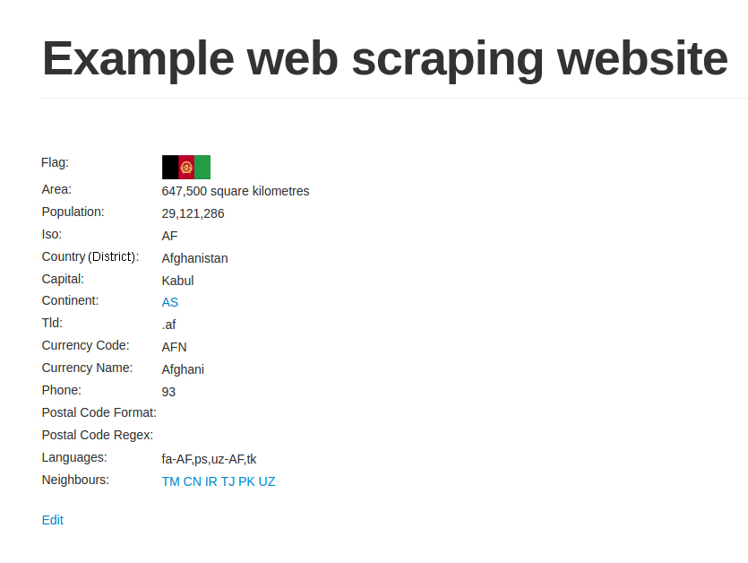

[toc]

### 1.5.4　ID遍历爬虫

本节中，我们将利用网站结构的弱点，更加轻松地访问所有内容。下面是一些示例国家（或地区）的URL。

+ http://example.python-scraping.com/view/Afghanistan-1
+ http://example.python-scraping.com/view/Australia-2
+ http://example.python-scraping.com/view/Brazil-3

可以看出，这些URL只在URL路径的最后一部分有所区别，包括国家（或地区）名（作为页面别名）和ID。在URL中包含页面别名是非常普遍的做法，可以对搜索引擎优化起到帮助作用。一般情况下，Web服务器会忽略这个字符串，只使用ID来匹配数据库中的相关记录。下面我们将其移除，查看 `http://example.python-scraping.com/view/1` ，测试示例网站中的链接是否仍然可用。测试结果如图1.1所示。


<center class="my_markdown"><b class="my_markdown">图1.1</b></center>

从图1.1中可以看出，网页依然可以加载成功，也就是说该方法是有用的。现在，我们就可以忽略页面别名，只利用数据库ID来下载所有国家（或地区）的页面了。下面是使用了该技巧的代码片段。

```python
import itertools
def crawl_site(url):
    for page in itertools.count(1):
        pg_url = '{}{}'.format(url, page)
        html = download(pg_url)
        if html is None:
            break
        # success - can scrape the result
```

现在，我们可以使用该函数传入基础URL。

```python
>>> crawl_site('http://example.python-scraping.com/view/-')
Downloading: http://example.python-scraping.com/view/-1
Downloading: http://example.python-scraping.com/view/-2
Downloading: http://example.python-scraping.com/view/-3
Downloading: http://example.python-scraping.com/view/-4
[...]
```

在这段代码中，我们对ID进行遍历，直到出现下载错误时停止，我们假设此时抓取已到达最后一个国家（或地区）的页面。不过，这种实现方式存在一个缺陷，那就是某些记录可能已被删除，数据库ID之间并不是连续的。此时，只要访问到某个间隔点，爬虫就会立即退出。下面是这段代码的改进版本，在该版本中连续发生多次下载错误后才会退出程序。

```python
def crawl_site(url, max_errors=5):
    for page in itertools.count(1):
        pg_url = '{}{}'.format(url, page)
        html = download(pg_url)
        if html is None:
            num_errors += 1
            if num_errors == max_errors:
                # max errors reached, exit loop
                break
        else:
            num_errors = 0
            # success - can scrape the result
```

上面代码中实现的爬虫需要连续5次下载错误才会停止遍历，这样就很大程度上降低了遇到记录被删除或隐藏时过早停止遍历的风险。

在爬取网站时，遍历ID是一个很便捷的方法，但是和网站地图爬虫一样，这种方法也无法保证始终可用。比如，一些网站会检查页面别名是否在URL中，如果不是，则会返回 `404 Not Found` 错误。而另一些网站则会使用非连续大数作为ID，或是不使用数值作为ID，此时遍历就难以发挥其作用了。例如，Amazon使用ISBN作为可用图书的ID，这种编码包含至少10位数字。使用ID对ISBN进行遍历需要测试数十亿次可能的组合，因此这种方法肯定不是抓取该站内容最高效的方法。

正如你一直关注的那样，你可能已经注意到一些 `TOO MANY REQUESTS` 下载错误信息。现在无须担心它，我们将会在1.5.5节的“高级功能”部分中介绍更多处理该类型错误的方法。

