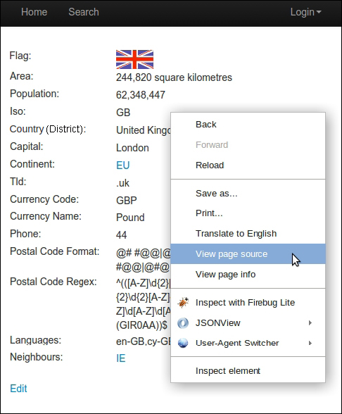
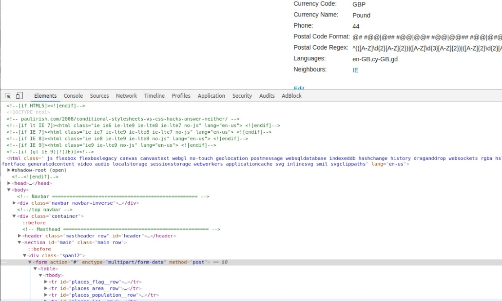
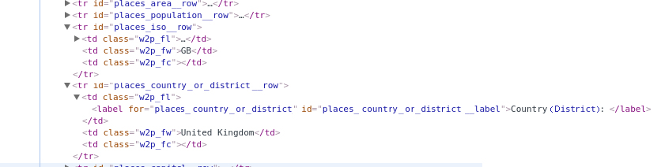

[toc]

### 2.1　分析网页

想要理解一个网页的结构如何，可以使用查看源代码的方法。在大多数浏览器中，都可以在页面上右键单击选择 **View page source** 选项，获取网页的源代码，如图2.1所示。


<center class="my_markdown"><b class="my_markdown">图2.1</b></center>

对于我们的示例网站来说，我们感兴趣的数据是在国家（或地区）页面中。让我们来查看一下页面源代码（通过浏览器菜单或右键单击浏览器菜单）。在英国的示例页面（ `http://example.python-scraping.com/view/United- Kingdom-239` ）的源代码中，你可以找到一个包含国家（或地区）数据的表格（可以在页面源代码中通过搜索来找到它）。

```python
<table>
<tr id="places_flag__row"><td class="w2p_fl"><label
for="places_flag"      id="places_flag__label">
Flag:</label></td>
<td class="w2p_fw"></td><td
class="w2p_fc"></td></tr>
...
<tr id="places_neighbours__row"><td class="w2p_fl"><label
for="places_neighbours"      id="places_neighbours__label">Neighbours:
</label></td><td class="w2p_fw"><div><a href="/iso/IE">IE
</a></div></td><td class="w2p_fc"></td></tr></table>
```

对于浏览器解析而言，缺失空白符和格式并无大碍，但在我们阅读时却会造成一定困难。想要更好地理解该表格，我们可以使用浏览器工具。要想找到你正在使用的浏览器中的开发者工具，通常情况下只需右键单击并选择类似 **Developer Tools** 的选项。根据你所使用的浏览器不同，可能会有不同的开发者工具选项，不过几乎每个浏览器都有一个名为 **Elements** 或 **HTML** 的选项卡。在Chrome和Firefox中，只需右键单击页面上的某个元素（你在抓取时感兴趣的元素），然后选择 **Inspect Element** 。而在IE中，则需要通过按下F12键打开 **Developer** 工具栏，然后通过按下Ctrl + B选择项目。如果你使用的是没有内置开发者工具的其他浏览器，可能需要尝试安装Firebug Lite扩展，该扩展对于大多数浏览器均可以使用，读者可自行搜索并下载安装该扩展。

当我在Chrome中右键单击页面中的表格，并点击 **Inspect Elements** 时，可以看到下面打开了一个面板，其中包含了选定元素的HTML层次结构，如图2.2所示。

在图2.2中，我们可以看到 `table` 元素位于一个 `form` 元素中。我们还可以看到国家（或地区）属性包含在带有不同CSS ID的 `tr` （即表格的行）元素中（显示为 `id="places_flag__row"` ）。由于浏览器的不同，颜色或样式可能会有所区别，不过你应该都可以点击元素，通过层次结构定位到页面中看到数据。

当我通过点击 `tr` 元素旁边的箭头，进一步展开时，可以注意到每一行都包含一个类名为 `w2p_fw` 的 `<td>` 元素，这些元素都是 `<tr>` 元素的子元素，如图2.3所示。


<center class="my_markdown"><b class="my_markdown">图2.2</b></center>


<center class="my_markdown"><b class="my_markdown">图2.3</b></center>

现在我们已经通过浏览器工具研究了页面，知道国家（或地区）数据表格的HTML层次结构，并且已经获得了从页面中抓取这些数据的必要信息。

