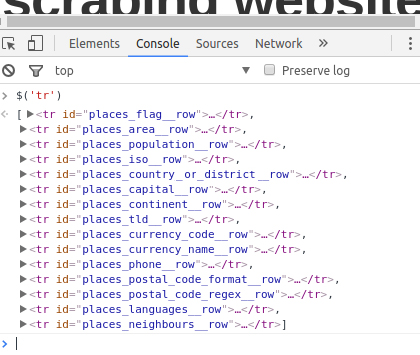
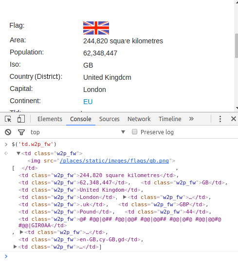

[toc]

## 2.3　CSS选择器和浏览器控制台

类似我们在使用 `cssselect` 时使用的标记，CSS选择器可以表示选择元素时所使用的模式。下面是一些你需要知道的常用选择器示例。

```python
Select any tag: *
Select by tag <a>: a
Select by class of "link": .link
Select by tag <a> with class "link": a.link
Select by tag <a> with ID "home": a#home
Select by child <span> of tag <a>: a > span
Select by descendant <span> of tag <a>: a span
Select by tag <a> with attribute title of "Home": a[title=Home]
```

`cssselect` 库实现了大部分CSS3选择器的功能，其不支持的功能（主要是浏览器交互）可以查看 `https://cssselect.readthedocs.io/en/ latest/#supported-selectors` 。

> 
> W3C已提出CSS3规范。在Mozilla针对CSS的开发者指南中，也有一个有用且更加易读的文档。

由于我们在第一次编写时可能不会十分完美，因此有时测试CSS选择器十分有用。在编写大量无法确定能够工作的Python代码之前，在某个地方调试任何与选择器相关的问题进行测试是一个不错的主意。

当一个网站使用jQuery时，可以非常容易地在浏览器控制台中测试CSS选择器。控制台是你使用的浏览器中开发者工具的一部分，可以让你在当前页面中执行JavaScript代码（如果支持的话，还可以执行jQuery）。

> 
> 如果想要更多地了解jQuery，可以学习一些免费的在线课程。

使用包含jQuery的CSS选择器时，你唯一需要知道的语法就是对象选择（如 `$('div.class_name');` ）。jQuery使用$和圆括号来选择对象。在括号中，你可以编写任何CSS选择器。对于支持jQuery的站点，在你浏览器的控制台中执行它，可以看到你所选择的对象。由于我们已经知道示例网站中使用了jQuery（无论是通过查看源代码，还是通过网络选项卡观察到的jQuery加载，或者是使用 `detectem` 模块），我们可以尝试使用CSS选择器选择所有的 `tr` 元素，如图2.4所示。


<center class="my_markdown"><b class="my_markdown">图2.4</b></center>

仅仅通过使用标签名，我们就可以看到国家（或地区）数据中的每一行。我还可以使用更长的CSS选择器来选择元素。下面让我们尝试选择所有带有 `w2p_fw` 类的 `td` 元素，因为我知道这里包含了页面中展示的最主要的数据，如图2.5所示。


<center class="my_markdown"><b class="my_markdown">图2.5</b></center>

你可能还会注意到，当你使用鼠标点击返回的元素时，可以展开它们，并且能够在上面的窗口中高亮显示（依赖于你所使用的浏览器）。这是一个非常有用的测试数据的方法。如果你所抓取的网站在浏览器中不支持加载jQuery或者任何其他对选择器友好的库，那么你可以仅仅使用JavaScript通过 `document` 对象实现相同的查询。 `querySelector` 方法的文档可以在Mozilla开发者网络中获取到。

即使你已经学会了在控制台中使用 `lxml` 的CSS选择器，学习XPath依然是非常有用的，因为 `lxml` 在求值之前会将所有的CSS选择器转换为XPath。让我们继续学习如何使用XPath，来吧！

