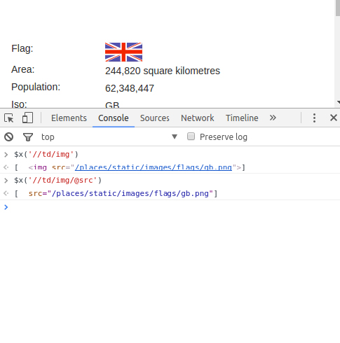

[toc]

### 2.4　XPath选择器

有时候使用CSS选择器无法正常工作，尤其是在HTML非常不完整或存在格式不当的元素时。尽管像 `BeautifulSoup` 和 `lxml` 这样的库已经尽了最大努力来纠正解析并清理代码，然而它可能还是无法工作，在这些情况下，XPath可以帮助你基于页面中的层次结构关系构建非常明确的选择器。

XPath是一种将XML文档的层次结构描述为关系的方式。因为HTML是由XML元素组成的，因此我们也可以使用XPath从HTML文档中定位和选择元素。

> 
> 如果你想了解更多XPath相关的知识，可以查阅Mozilla的开发者文档。

XPath遵循一些基本的语法规则，并且和CSS选择器有些许相似。表2.1所示为这两种方法的一些快速参考。

<center class="my_markdown"><b class="my_markdown">表2.1</b></center>

| 选择器描述 | XPath选择器 | CSS选择器 |
| :-----  | :-----  | :-----  | :-----  | :-----  |
| 选择所有链接 | '//a' | 'a' |
| 选择类名为"main"的div元素 | '//div[@class="main"]' | 'div.main' |
| 选择ID为"list"的ul元素 | '//ul[@id="list"]' | 'ul#list' |
| 从所有段落中选择文本 | '//p/text()' | 'p'* |
| 选择所有类名中包含'test'的div元素 | '//div[contains(@class, 'test')]' | 'div [class*="test"]' |
| 选择所有包含链接或列表的div元素 | '//div[a|ul] ' | 'div a, div ul' |
| 选择href属性中包含google.com的链接 | '//a[contains(@href, "google.com")] | 'a'* |

从表2.1中可以看到，两种方式的语法有许多相似之处。不过，在表2.1中，有一些CSS选择器使用*表示，代表使用CSS选择这些元素是不可能的，我们已经提供了最佳的替代方案。在这些例子中，如果你使用的是 `cssselect` ，那么还需要在Python和/或 `lxml` 中做进一步的处理或迭代。希望这个对比已经给出了XPath的介绍，并且能够让你相信它比使用CSS更加严格、具体。

在我们学习了XPath语法的基本介绍之后，再来看下如何在我们的示例网站中使用它。

```python
>>> tree = fromstring(html)
>>> area =
tree.xpath('//tr[@id="places_area__row"]/td[@class="w2p_fw"]/text()')[0]
>>> print(area)
244,820 square kilometres
```

和CSS选择器类似，你同样也可以在浏览器控制台中测试XPath选择器。要想实现该目的，只需在页面中使用 `$x('pattern_here');` 选择器。相似地，你也可以只使用JavaScript的 `document` 对象，并调用其 `evaluate` 方法。

> 
> Mozilla开发者网络中有一篇非常有用的教程，介绍了在JavaScript中使用XPath的方法，其网址为 `https://developer.mozilla.org/en-US/ docs/Introduction_to_using_XPath_in_JavaScript` 。

假如我们想要测试查找带有图片的 `td` 元素，来获取国家（或地区）页面中的旗帜数据的话，可以先在浏览器中测试XPath表达式，如图2.6所示。


<center class="my_markdown"><b class="my_markdown">图2.6</b></center>

在这里可以看到，我们可以使用属性来指明想要抽取的数据（比如 `@src` ）。通过在浏览器中进行测试，我们可以凭借获取即时并且易读的结果，节省调试时间。

在本章及后续章节中，XPath和CSS选择器都会使用到，这样你就可以更加熟悉它们，并且在你提高自己的网络爬虫能力时，对它们的使用更加自信。

