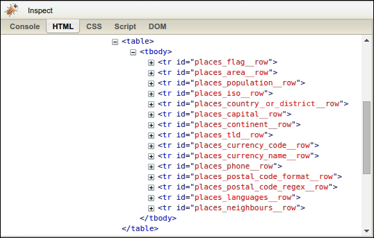

[toc]

### 2.6　性能对比

要想更好地对2.2节中介绍的3种抓取方法评估取舍，我们需要对其相对效率进行对比。一般情况下，爬虫会抽取网页中的多个字段。因此，为了让对比更加真实，我们将为本章中的每个爬虫都实现一个扩展版本，用于抽取国家（或地区）网页中的每个可用数据。首先，我们需要回到浏览器中，检查国家（或地区）页面其他特征的格式，如图2.7所示。


<center class="my_markdown"><b class="my_markdown">图2.7</b></center>

通过使用浏览器的查看功能，我们可以看到表格中的每一行都拥有一个以 `places_` 起始且以 `__row` 结束的ID。而在这些行中包含的国家（或地区）数据，其格式都和面积示例相同。下面是使用上述信息抽取所有可用国家（或地区）数据的实现代码。

```python
FIELDS = ('area', 'population', 'iso', 'country_or_district', 'capital', 'continent',
'tld', 'currency_code', 'currency_name', 'phone', 'postal_code_format',
'postal_code_regex', 'languages', 'neighbours')
import re
def re_scraper(html):
    results = {}
    for field in FIELDS:
        results[field] = re.search('<tr id="places_%s__row">.*?<td
class="w2p_fw">(.*?)</td>' % field, html).groups()[0]
    return results
from bs4 import BeautifulSoup
def bs_scraper(html):
    soup = BeautifulSoup(html, 'html.parser')
    results = {}
    for field in FIELDS:
        results[field] = soup.find('table').find('tr',id='places_%s__row' %
field).find('td', class_='w2p_fw').text
    return results
from lxml.html import fromstring
def lxml_scraper(html):
    tree = fromstring(html)
    results = {}
    for field in FIELDS:
        results[field] = tree.cssselect('table > tr#places_%s__row >
td.w2p_fw' % field)[0].text_content()
    return results
def lxml_xpath_scraper(html):
    tree = fromstring(html)
    results = {}
    for field in FIELDS:
        results[field] =
tree.xpath('//tr[@id="places_%s__row"]/td[@class="w2p_fw"]' %
field)[0].text_content()
    return results
```

