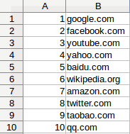

[toc]

### 4.1.1　解析Alexa列表

Alexa网站列表是以电子表格的形式提供的，表格中包含两列内容，分别是排名和域名，如图4.1所示。


<center class="my_markdown"><b class="my_markdown">图4.1</b></center>

抽取数据包含如下4个步骤。

1．下载 `.zip` 文件。

2．从 `.zip` 文件中提取出CSV文件。

3．解析CSV文件。

4．遍历CSV文件中的每一行，从中抽取出域名数据。

下面是实现上述功能的代码。

```python
import csv
from zipfile import ZipFile
from io import BytesIO, TextIOWrapper
import requests
resp = requests.get('http://s3.amazonaws.com/alexa-static/top-1m.csv.zip',
stream=True)
urls = [] # top 1 million URL's will be stored in this list
with ZipFile(BytesIO(resp.content)) as zf:
    csv_filename = zf.namelist()[0]
    with zf.open(csv_filename) as csv_file:
    for _, website in csv.reader(TextIOWrapper(csv_file)):
        urls.append('http://' + website)
```

你可能已经注意到，下载得到的压缩数据是在使用 `BytesIO` 类封装之后，才传给 `ZipFile` 的。这是因为 `ZipFile` 需要一个类似文件的接口，而不是原生字节对象。我们还设置了 `stream=True` ，帮助加速请求。接下来，我们从文件名列表中提取出CSV文件的名称。由于这个 `.zip` 文件中只包含一个文件，所以我们直接选择第一个文件名即可。然后，使用 `TextIOWrapper` 读取CSV文件，它将协助处理编码和读取问题。该文件之后会被遍历，并将第二列中的域名数据添加到URL列表中。为了使URL合法，我们还会在每个域名前添加 `http://` 协议。

要想在之前开发的爬虫中复用上述功能，还需将其修改为一个简单的回调类。

```python
class AlexaCallback:
    def __init__(self, max_urls=500):
        self.max_urls = max_urls
        self.seed_url =
'http://s3.amazonaws.com/alexa-static/top-1m.csv.zip'
        self.urls = []
    def __call__(self):
        resp = requests.get(self.seed_url, stream=True)
        with ZipFile(BytesIO(resp.content)) as zf:
            csv_filename = zf.namelist()[0]
            with zf.open(csv_filename) as csv_file:
                for _, website in csv.reader(TextIOWrapper(csv_file)):
                    self.urls.append('http://' + website)
                    if len(self.urls) == self.max_urls:
                        break
```

这里添加了一个新的输入参数 `max_urls` ，用于设定从Alexa文件中提取的URL数量。默认情况下，该值被设置为500个URL，这是因为下载100万个网页的耗时过长（正如本章开始时提到的，串行下载需要花费超过11天的时间）。

