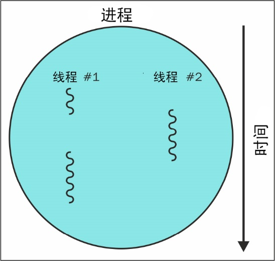

[toc]

### 4.4　线程和进程如何工作

图4.2所示为一个包含有多个线程的进程的执行过程。

<b class="my_markdown">图4.2</b>

当运行Python脚本或其他计算机程序时，就会创建包含有代码、状态以及堆栈的进程。这些进程通过计算机的一个或多个CPU核心来执行。不过，同一时刻每个核心只会执行一个线程，然后在不同进程间快速切换，这样就给人以多个程序同时运行的感觉。同理，在一个进程中，程序的执行也是在不同线程间进行切换的，每个线程执行程序的不同部分。

这就意味着当一个线程等待网页下载时，进程可以切换到其他线程执行，避免浪费CPU周期。因此，为了充分利用计算机中的所有计算资源尽可能快地下载数据，我们需要将下载分发到多个进程和线程中。

