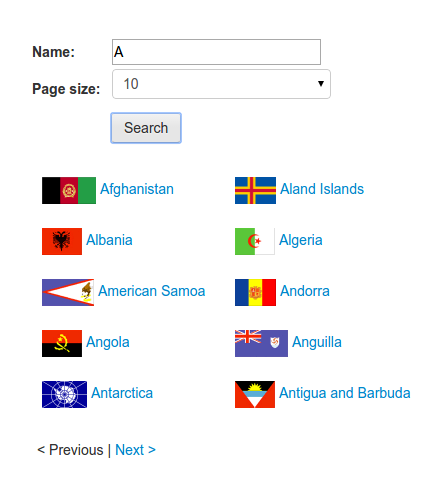
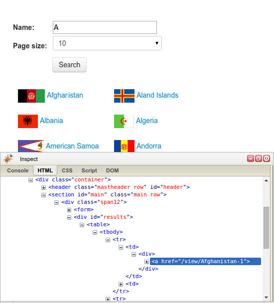

[toc]

### 5.1　动态网页示例

让我们来看一个动态网页的例子。示例网站有一个搜索表单，可以通过 `http://example.python-scraping.com/search` 进行访问，该页面用于查询国家（或地区）。比如说，我们想要查找所有起始字母为A的国家（或地区），其搜索结果页面如图5.1所示。


<center class="my_markdown"><b class="my_markdown">图5.1</b></center>

如果我们右键单击结果部分，使用浏览器工具查看元素（参见第2章），可以发现结果被存储在ID为“ `result` ”的 `div` 元素之中，如图5.2所示。

让我们尝试使用 `lxml` 模块抽取这些结果，这里用到的知识在第2章和第3章的 `Downloader` 类中都已经介绍过了。

```python
>>> from lxml.html import fromstring
>>> from downloader import Downloader
>>> D = Downloader()
>>> html = D('http://example.python-scraping.com/search')
>>> tree = fromstring(html)
>>> tree.cssselect('div#results a')
[]
```


<center class="my_markdown"><b class="my_markdown">图5.2</b></center>

这个示例爬虫在抽取结果时失败了。检查网页源代码（通过使用鼠标右键单击View Page Source选项，而不是使用浏览器工具）可以帮助我们了解抽取操作为什么会失败。在源代码中，可以发现我们准备抓取的 `div` 元素实际上是空的，如下所示。

```python
<div id="results">
</div>
```

而浏览器工具显示给我们的却是网页的当前状态，在本例中就是使用JavaScript动态加载完搜索结果之后的网页。下一节中，我们将使用浏览器工具的另一个功能来了解这些结果是如何加载的。

> 　 **什么是AJAX**
> AJAX指异步JavaScript和XML（Asynchronous JavaScript and XML），于2005年引入，描述了一种跨浏览器动态生成Web应用内容的功能。更重要的是， `XMLHttpRequest` ——这个最初微软为ActiveX实现的JavaScript对象，目前已经得到大多数浏览器的支持。该技术允许JavaScript创建到远程服务器的HTTP请求并获得响应，也就是说Web应用可以传输和接收数据。而以前客户端与服务端交互的方式则是刷新整个网页，这种方式的用户体验比较差，并且在只需传输少量数据时会造成带宽浪费。
> Google的Gmail和地图站点是动态Web应用的早期实验者，也对AJAX成为主流起到了重要的帮助作用。

