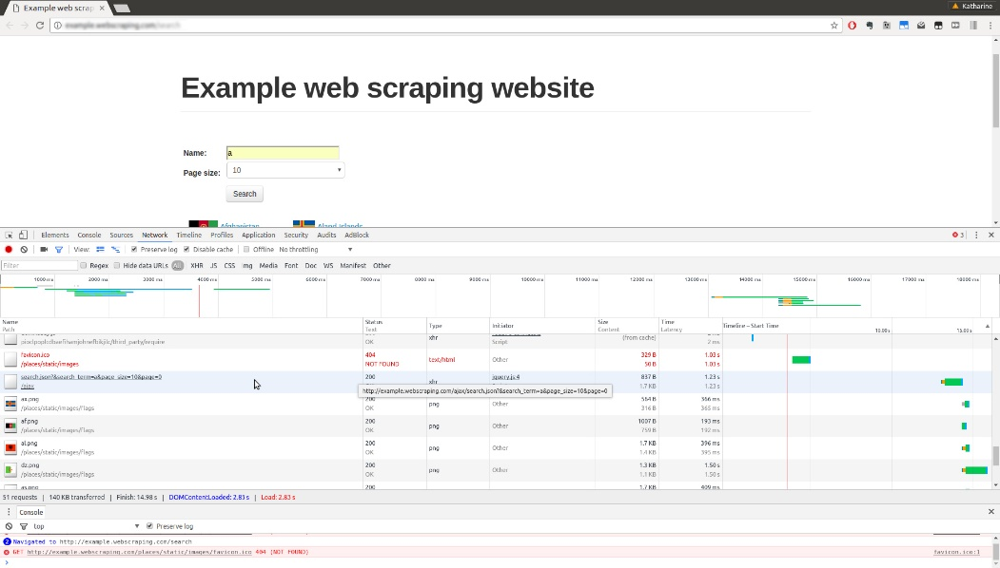
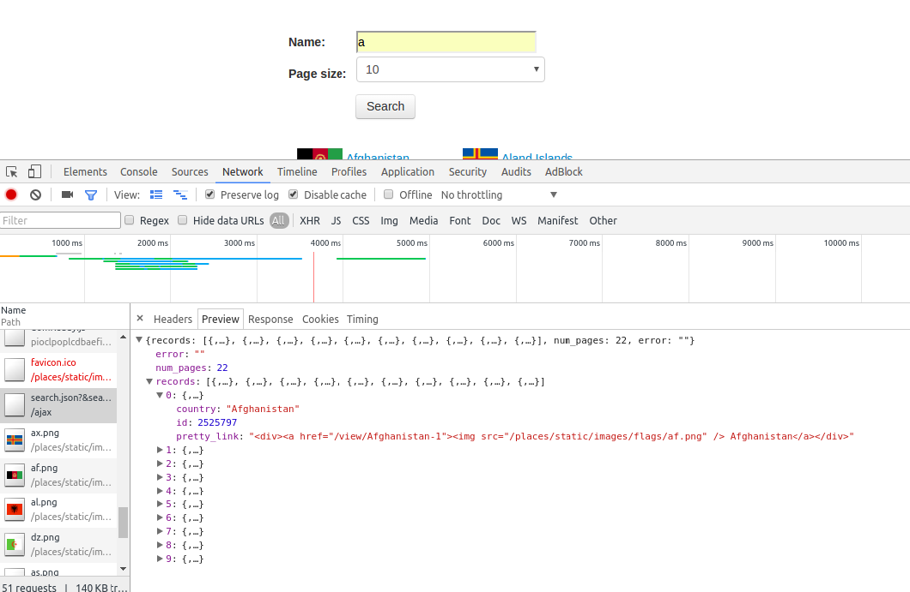

[toc]

### 5.2　对动态网页进行逆向工程

到目前为止，我们抓取网页数据使用的都是第2章中介绍的方法。该方法在本章的示例网页中无法正常运行，因为该网页中的数据是使用JavaScript动态加载的。要想抓取该数据，我们需要了解网页是如何加载该数据的，该过程也可以描述为逆向工程。继续上一节的例子，在浏览器工具中单击 **Network** 选项卡，然后执行一次搜索，我们将会看到对于给定页面的所有请求。

请求太多了！当我们滚动这些请求时，可以看到请求主要都是图片（加载的旗帜），然后我们会发现一个有意思的名字： `search.json` ，其路径为 `/ajax` ，如图5.3所示。

如果我们使用Chrome点击该URL，可以看到更多细节（所有主流浏览器都有类似功能，因此即使你看到的外观可能有所不同，但主要的功能是相似的）。当我们点击感兴趣的URL时，可以看到更多细节，包括以解析形式向我们展示响应的预览。

这里与Elements选项卡中的Inspect Element视图类似，我们可以使用箭头展开预览，此时可以看到结果中的每个国家（或地区）都包含在JSON格式中，如图5.4所示。


<center class="my_markdown"><b class="my_markdown">图5.3</b></center>


<center class="my_markdown"><b class="my_markdown">图5.4</b></center>

我们也可以通过右键单击的方式直接在新标签页中打开该URL。当你这样操作时，会发现它就是一个简单的JSON响应。这个AJAX数据不仅可以在Network选项卡或浏览器中访问到，也可以直接下载，如下面的代码所示。

```python
>>> import requests
>>> resp =
requests.get('http://example.python-scraping.com/ajax/search.json?page=0&page_s
ize=10&search_term=a')
>>> resp.json()
{'error': '',
 'num_pages': 21,
 'records': [{'country_or_district': 'Afghanistan',
 'id': 1261,
 'pretty_link': '<div><a href="/view/Afghanistan-1">Afghanistan</a></div>'},
 ...]
}
```

从前面的代码中可以看出， `requests` 库可以让我们通过 `json` 方法，以Python字典的形式访问JSON响应。我们也可以下载原始字符串响应，然后使用 `json.loads` 方法进行加载。

我们的代码为我们提供了一个简单的方法来抓取包含字母A的国家（或地区）。要想获取所有国家（或地区）的信息，我们需要对字母表中的每个字母调用一次AJAX搜索。而且对于每个字母，搜索结果还会被分割成多个页面，实际页数和请求时的 `page_size` 相关。

不过，我们不能保存所有返回的结果，因为同一个国家（或地区）可能会在多次搜索时返回，比如 `Fiji` 会匹配 `f` 、 `i` 、 `j` 三次搜索结果。这些重复的搜索结果需要过滤处理，这里采用的方法是在写入文本文件之前先将结果存储到集合中，因为集合这种数据类型能够确保元素唯一。

下面是其实现代码，通过搜索字母表中的每个字母，然后遍历JSON响应的结果页面，来抓取所有国家（或地区）信息。其产生的结果将会存储在简单的文本文件当中。

```python
import requests
import string
PAGE_SIZE = 10
template_url = 'http://example.python-scraping.com/ajax/' +
    'search.json?page={}&page_size={}&search_term={}'
countries_or_districts = set()
for letter in string.ascii_lowercase:
    print('Searching with %s' % letter)
    page = 0
    while True:
        resp = requests.get(template_url.format(page, PAGE_SIZE, letter))
        data = resp.json()
        print('adding %d more records from page %d' %
              (len(data.get('records')), page))
        for record in data.get('records'):
            countries.add(record['country_or_district'])
        page += 1
        if page >= data['num_pages']:
            break
with open('../data/countries_or_districts.txt', 'w') as countries_or_districts_ file:
    countries_or_districts_file.write('n'.join(sorted(countries_or_districts)))
```

当你运行该代码时，将会看到不断前行的输出。

```python
$ python chp5/json_scraper.py
Searching with a
adding 10 more records from page 0
adding 10 more records from page 1
...
```

当脚本执行完成时，相对目录 `../data/` 下的 `countries_or_ districts.txt` 文件中，将会显示一个排序的国家（或地区）名称列表。你可能还会注意到，页面长度可以使用全局变量 `PAGE_SIZE` 设置。你可能需要尝试修改它，以增加或减少请求数。

该AJAX爬虫提供的抽取国家（或地区）信息的方法，比第2章中介绍的传统的逐页抓取方式更简单。这其实是一个日常经验：依赖于AJAX的网站虽然乍看起来更加复杂，但是其结构促使数据和表现层分离，因此我们在抽取数据时会更加容易。如果你发现一个网站拥有类似该示例站点的开放应用编程接口（API），那么你就可以只抓取其API，而无须再使用CSS选择器和XPath加载HTML中的数据了。

