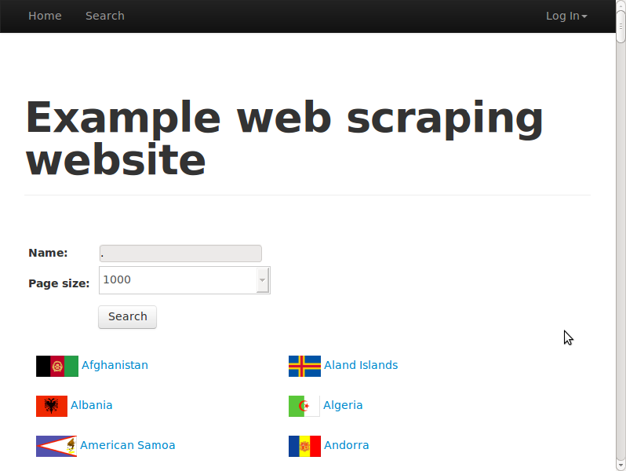

[toc]

### 5.3.3　使用WebKit与网站交互

我们用于测试的搜索网页需要用户修改后提交搜索表单，然后单击页面链接。而前面介绍的浏览器渲染引擎只能执行JavaScript，然后访问生成的HTML。要想抓取搜索页面，我们还需要对浏览器渲染引擎进行扩展，使其支持交互功能。幸运的是，Qt包含了一个非常棒的API，可以选择和操纵HTML元素，使实现变得简单。

对于之前的AJAX搜索示例，下面给出另一个实现版本，该版本已经将搜索条件设为'.'，每页显示数量设为 `'1000'` ，这样只需一次请求就能获取到全部结果。

```python
app = QApplication([])
webview = QWebView()
loop = QEventLoop()
webview.loadFinished.connect(loop.quit)
webview.load(QUrl('http://example.python-scraping.com/search'))
loop.exec_()
webview.show()
frame = webview.page().mainFrame()
frame.findFirstElement('#search_term').
       setAttribute('value', '.')
frame.findFirstElement('#page_size option:checked').
       setPlainText('1000')
frame.findFirstElement('#search').
       evaluateJavaScript('this.click()')
app.exec_()
```

最开始几行和之前的 `Hello World` 示例一样，初始化了一些用于渲染网页的Qt对象。之后，调用 `QWebView`  GUI的 `show()` 方法来显示渲染窗口，这样可以方便调试。然后，创建了一个指代框架的变量，可以让后面几行代码更短。

`QWebFrame` 类有很多与网页交互的有用方法。包含 `findFirstElement` 的3行使用CSS选择器在框架中定位元素，然后设置搜索参数。而后表单使用 `evaluateJavaScript()` 方法进行提交，模拟点击事件。该方法非常实用，因为它允许我们插入并执行任何我们提交的JavaScript代码，包括直接调用网页中定义的JavaScript方法。最后一行进入应用的事件循环，此时我们可以对表单操作进行复查。如果没有使用该方法，脚本将会直接退出。

图5.5所示为脚本运行时的显示界面。


<center class="my_markdown"><b class="my_markdown">图5.5</b></center>

代码最后一行中，我们运行了 `app._exec()` ，它是一个阻塞调用，可以防止任何其他代码行在该线程中执行。通过使用 `webkit.show()` 查看你的代码如何运转，是调试应用以及确定网页上实际发生了什么的很好的方式。

如果想要停止应用运行，只需关闭Qt窗口（或Python解释器）即可。

#### 1．等待结果

实现WebKit爬虫的最后一部分是抓取搜索结果，而这又是最难的一部分，因为我们难以预估完成AJAX事件以及国家（或地区）数据加载完成的时间。有三种方法可以处理该难题，分别是：

+ 等待一定时间，期望AJAX事件能够在此之前完成；
+ 重写Qt的网络管理器，跟踪URL请求的完成时间；
+ 轮询网页，等待特定内容出现。

第一种方案最容易实现，不过效率也最低，因为一旦设置了安全的超时时间，就会使脚本花费过多时间等待。而且，当网络速度比平常慢时，固定的超时时间会出现请求失败的情况。第二种方案虽然更加高效，但如果是客户端延时，则无法使用。比如，已经完成下载，但是需要再单击一个按钮才会显示内容这种情况，延时就出现在客户端。第三种方案尽管存在一个小缺点，即会在检查内容是否加载完成时浪费CPU周期，但是该方案更加可靠且易于实现。下面是使用第三种方案的实现代码。

```python
>>> elements = None
>>> while not elements:
... app.processEvents()
... elements = frame.findAllElements('#results a')
...
>>> countries = [e.toPlainText().strip() for e in elements]
>>> print(countries_or_districts)
['Afghanistan', 'Aland Islands', ... , 'Zambia', 'Zimbabwe']
```

如上实现中，代码将停留在 `while` 循环中，直到国家（或地区）链接出现在 `results` 这个 `div` 元素中。每次循环，都会调用 `app.processEvents()` ，用于给Qt事件循环执行任务的时间，比如响应点击事件和更新GUI。我们还可以在该循环中添加一个短时间的 `sleep` ，以便CPU间歇休息。

本示例的完整代码位于本书源码文件的 `chp5` 文件夹中，其名为 `pyqt_search.py` 。

