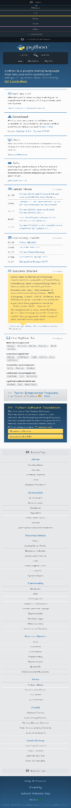

[toc]

### 5.4.1　Selenium

使用前面小节中的WebKit库，我们可以自定义浏览器渲染引擎，这样就能完全控制想要执行的行为。如果不需要这么高的灵活性，那么还有一个不错的更容易安装的替代品Selenium可以选择，它提供的API接口可以自动化处理多个常见浏览器。Selenium可以通过如下命令使用 `pip` 安装。

```python
pip install selenium
```

为了演示Selenium是如何运行的，我们会把之前的搜索示例重写成Selenium的版本。首先，创建一个到浏览器的连接。

```python
>>> from selenium import webdriver
>>> driver = webdriver.Firefox()
```

当该命令运行时，会弹出一个空的浏览器窗口。不过如果你得到了错误信息，则可能需要安装 `geckodriver` （ `https://github.com/mozilla/geckodriver/releases` ），并确保它在你的 `PATH` 变量中可用。

使用浏览器可以看到页面并进行交互（而不是Qt组件），这个功能非常方便，因为在执行每条命令时，都可以通过浏览器窗口来检查脚本是否依照预期运行。尽管这里我们使用的浏览器是Firefox，不过Selenium也提供了连接其他常见浏览器的接口，比如Chrome和IE。需要注意的是，我们只能使用系统中已安装浏览器的Selenium接口。

> 
> 如果你想了解Selenium是否支持你系统中的浏览器，以及你可能需要安装的其他依赖或驱动，请查阅Selenium文档中关于支持平台的介绍。

如果想在选定的浏览器中加载网页，可以调用 `get()` 方法。

```python
>>> driver.get('http://example.python-scraping.com/search')
```

然后，设置需要选取的元素，这里使用的是搜索文本框的ID。此外，Selenium也支持使用CSS选择器或XPath来选取元素。当找到搜索文本框之后，我们可以通过 `send_keys()` 方法输入内容，模拟键盘输入。

```python
>>> driver.find_element_by_id('search_term').send_keys('.')
```

为了让所有结果可以在一次搜索后全部返回，我们希望把每页显示的数量设置为1000。但是，由于Selenium的设计初衷是与浏览器交互，而不是修改网页内容，因此这种想法并不容易实现。要想绕过这一限制，我们可以使用JavaScript语句直接设置选项框的内容。

```python
>>> js = "document.getElementById('page_size').options[1].text = '1000';"
>>> driver.execute_script(js)
```

此时表单内容已经输入完毕，下面就可以单击搜索按钮执行搜索了。

```python
>>> driver.find_element_by_id('search').click()
```

我们需要等待AJAX请求完成之后才能加载结果，在之前讲解的WebKit实现中这里是最难的一部分脚本。不过幸运的是，Selenium为该问题提供了一个简单的解决方法，那就是可以通过 `implicitly_wait()` 方法设置超时时间。

```python
>>> driver.implicitly_wait(30)
```

此处，我们设置了30秒的延时。如果我们要查找的元素没有出现，Selenium至多等待30秒，然后就会抛出异常。Selenium还允许使用显式等待进行更详细的轮询控制。

要想选取国家（或地区）链接，我们依然可以使用WebKit示例中用过的那个CSS选择器。

```python
>>> links = driver.find_elements_by_css_selector('#results a')
```

然后，抽取每个链接的文本，并创建一个国家（或地区）列表。

```python
>>> countries_or_districts = [link.text for link in links]
>>> print(countries_or_districts)
['Afghanistan', 'Aland Islands', ... , 'Zambia', 'Zimbabwe']
```

最后，调用 `close()` 方法关闭浏览器。

```python
>>> driver.close()
```

本示例的源代码位于本书源码文件的 `chp5` 文件夹中，其名为 `selenium_search.py` 。如果想进一步了解Selenium这个Python库，可以通过 `https://selenium-python.readthedocs.org/` 获取其文档。

#### 1．Selenium与无界面浏览器

尽管通过常见浏览器安装和使用Selenium相当方便、容易，但是在服务器上运行这些脚本时则会出现问题。对于服务器而言，更常使用的是无界面浏览器。它们往往也比功能完整的Web浏览器更快且更具可配置性。

本书出版时最流行的无界面浏览器是PhantomJS。它通过自身的基于JavaScript的WebKit引擎运行。PhantomJS可以在大多数服务器中很容易地进行安装，并且可以遵照最新的下载说明在本地安装。

在Selenium中使用PhantomJS只需要进行一个不同的初始化。

```python
>>> from selenium import webdriver
>>> driver = webdriver.PhantomJS() # note: you should use the phantomjs
executable path here
 # if you see an error (e.g.
PhantomJS('/Downloads/pjs'))
```

你能注意到的第一个区别是此时不会打开浏览器窗口，但是已经有PhantomJS实例在运行。要想测试我们的代码，可以访问一个页面并进行截图。

```python
>>> driver.get('http://python.org')
>>> driver.save_screenshot('../data/python_website.png')
True
```

现在当你打开保存的PNG文件时，可以看到PhantomJS浏览器渲染的结果，如图5.6所示。


<center class="my_markdown"><b class="my_markdown">图5.6</b></center>

我们注意到这是一个长窗口。我们可以通过使用 `maximize_window` 或通过 `set_window_size` 设置窗口大小对其进行改变，无论哪种用法都已经在 `Selenium Python documentation on the WebDriver API` 中进行了详细的文档说明。

对于任何Selenium问题的调试来说，截图功能都是很有用的，即使是在你对真实浏览器使用Selenium时——有时候因为一些页面加载缓慢，或是网站的页面结构或JavaScript发生变化，可能会导致脚本运行失败。当发生错误时正好有页面的截图则会非常有帮助。此外，你可以使用驱动的 `page_source` 属性保存或查看当前页面的源代码。

使用类似Selenium这样基于浏览器的解析器的另一个原因是，它表现得更加不像爬虫。一些网站使用类似蜜罐的防爬技术，在该网站的页面上可能会包含隐藏的有毒链接，当你通过脚本点击它时，将会使你的爬虫被封禁。对于这类问题，由于Selenium基于浏览器的架构，因此可以成为更加强大的爬虫。当你不能在浏览器中点击或看到一个链接时，你也无法通过Selenium与其进行交互。此外，你的头部将包含你使用的确切浏览器，而且你还可以使用正常浏览器的功能，比如cookie、会话以及加载图片和交互元素，这些功能有时需要加载特定的表单或页面。如果你的爬虫必须与页面进行交互，并且行为需要更加“类似人类”，那么Selenium是一个不错的选择。

