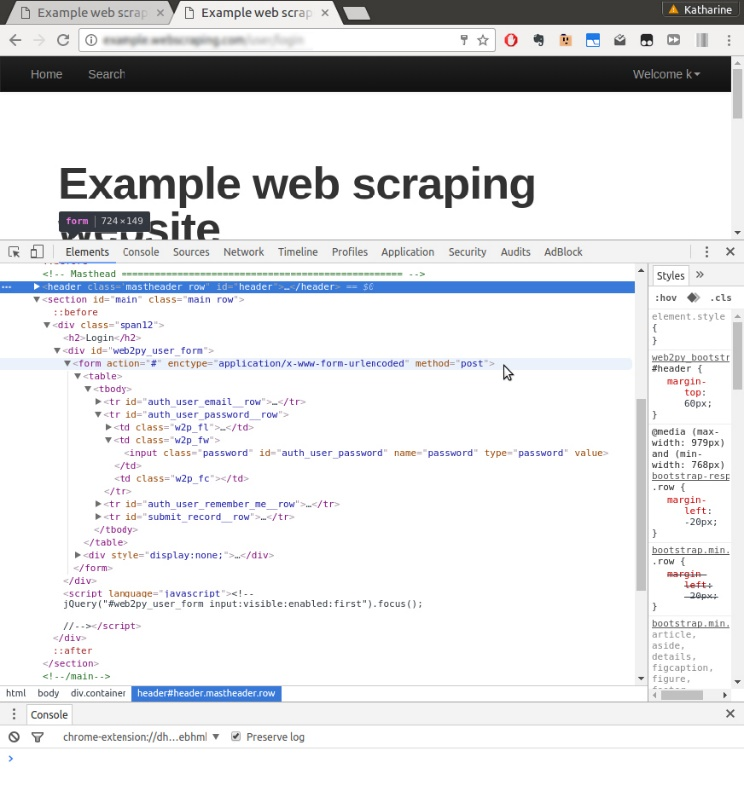

[toc]

### 6.1　登录表单

我们最先要实施自动化提交的是 **登录** 表单，其网址为 `http://example. python-scraping.com/user/login` 。要想理解该表单，我们可以使用浏览器的开发者工具。如果使用完整版的Firebug或者Chrome开发者工具，我们只需提交表单就可以在网络选项卡中检查传输的数据（类似我们在第5章中做的操作）。不过，如果我们使用“Inspect Element”功能的话，只能看到关于表单的信息，如图6.1所示。


<center class="my_markdown"><b class="my_markdown">图6.1</b></center>

与如何发送表单有关的几个重要组成部分，分别是 `form` 标签的 `action` 、 `enctype` 和 `method` 属性，以及两个 `input` 域（在图6.1中，我们扩展了"password"域）。 `action` 属性用于设置表单数据提交的HTTP地址，本例中为 `#` ，也就是当前URL。 `enctype` 属性（或编码类型）用于设置数据提交的编码，本例中为 `application/x-www-form-urlencoded` 。而 `method` 属性被设为 `post` ，表示在请求体中使用 `POST` 方法向服务器端提交表单数据。对于每个 `input` 标签，最重要的属性是 `name` ，它用于设定 `POST` 数据提交到服务器端时某个域的名称。

> 　  **表单编码**
> 当表单使用 `POST` 方法时，表单数据提交到服务器端之前有两种编码类型可供选择。默认编码类型为 `application/x-www-form-urlencoded` ，此时所有非字母数字类型的字符都需要转换为十六进制的ASCII值。但是，如果表单中包含大量非字母数字类型的字符时，这种编码类型的效率就会非常低，比如处理二进制文件上传时就存在该问题，此时就需要定义 `multipart/formdata` 作为编码类型。使用这种编码类型时，不会对输入进行编码，而是使用MIME协议将其作为多个部分进行发送，和邮件的传输标准相同。

当普通用户通过浏览器打开该网页时，需要输入邮箱和密码，然后单击 **登录** 按钮将数据提交到服务端。如果登录成功，则会跳转到主页；否则，会跳转回 **登录** 页。下面是尝试自动化处理该流程的初始版本代码。

```python
>>> from urllib.parse import urlencode
>>> from urllib.request import Request, urlopen
>>> LOGIN_URL = 'http://example.python-scraping.com/user/login'
>>> LOGIN_EMAIL = 'example@python-scraping.com'
>>> LOGIN_PASSWORD = 'example'
>>> data = {'email': LOGIN_EMAIL, 'password': LOGIN_PASSWORD}
>>> encoded_data = urlencode(data)
>>> request = Request(LOGIN_URL, encoded_data.encode('utf-8'))
>>> response = urlopen(request)
>>> print(response.geturl())
 'http://example.python-scraping.com/user/login'
```

上述代码中，我们设置了邮件和密码域，并将其进行了 `urlencode` 编码，然后将这些数据提交到服务器端。当执行最后的打印语句时，输出的依然是 **登录** 页的URL，也就是说登录失败了。你会注意到，我们还必须将已经编码的数据作为字节再次进行编码，以便 `urllib` 能够接受它。

我们可以使用 `requests` 以几行代码实现同样的处理。

```python
>>> import requests
>>> response = requests.post(LOGIN_URL, data)
>>> print(response.url)
 'http://example.python-scraping.com/user/login'
```

`requests` 库可以让我们显式定义要POST的数据，并且可以在其内部进行编码。不过遗憾的是，这段代码仍然会登录失败。

这是因为 **登录** 表单十分严格，除邮箱和密码外，还需要提交另外几个域。我们可以从图6.1的最下方找到这几个域，不过由于设置为 `hidden` ，所以不会在浏览器中显示出来。为了访问这些隐藏域，下面将使用第2章中介绍的 `lxml` 库编写一个函数，提取表单中所有 `input` 标签的详情。

```python
from lxml.html import fromstring
def parse_form(html):
    tree = fromstring(html)
    data = {}
    for e in tree.cssselect('form input'):
        if e.get('name'):
            data[e.get('name')] = e.get('value')
    return data
```

上述代码使用 `lxml` 的CSS选择器遍历表单中所有的 `input` 标签，然后以字典的形式返回其中的 `name` 和 `value` 属性。对 **登录** 页运行该函数后，得到的结果如下所示。

```python
>>> html = requests.get(LOGIN_URL)
>>> form = parse_form(html.content)
>>> print(form)
{'_formkey': 'a3cf2b3b-4f24-4236-a9f1-8a51159dda6d',
 '_formname': 'login',
 '_next': '/',
 'email': '',
 'password': '',
 'remember_me': 'on'}
```

其中， `_formkey` 属性是这里的关键部分，它包含一个唯一的ID，服务器端使用该唯一的ID来避免表单被多次提交的问题。每次加载网页时，都会产生不同的ID，然后服务器端就可以通过这个给定的ID来判断表单是否已经提交过。下面是提交了 `_formkey` 及其他隐藏域的新版本登录代码。

```python
>>> html = requests.get(LOGIN_URL)
>>> data = parse_form(html.content)
>>> data['email'] = LOGIN_EMAIL
>>> data['password'] = LOGIN_PASSWORD
>>> response = requests.post(LOGIN_URL, data)
>>> response.url
'http://example.python-scraping.com/user/login'
```

很遗憾，这个版本依然不能正常工作，因为它再一次返回了登录URL。这是因为我们缺失了另一个必要的组成部分——浏览器cookie。当普通用户加载 **登录** 表单时， `_formkey` 的值将会保存在cookie中，然后该值会与提交的 **登录** 表单数据中的 `_formkey` 值进行对比。我们可以通过 `response` 对象来查看cookie及它们的值。

```python
>>> response.cookies.keys()
['session_data_places', 'session_id_places']
>>> response.cookies.values()
['"8bfbd84231e6d4dfe98fd4fa2b139e7f:NalmnUQ0oZtHRItjUOncTrmC30PeJpDgmAqXZEwLtR1RvKyFWBMeDnYQAIbWhKmnqVpdeo5Xbh41g87MgYB-
oOpLysB8zyQci2FhhgUYFA77ZbT0hD3o0NQ7aN_
BaFVrHS4DYSh297eTYHIhNagDjFRS4Nny_8KaAFdcOV3a3jw_pVnpOg
2Q95n2VvVqd1gug5pmjBjCNofpAGver3buIMxKsDV4y3TiFO97t2bSFKgghayz2z9jn_iOox2yn
8Ol5nBw7mhVEndlx62jrVCAVWJBMLjamuDG01XFNFgMwwZBkLvYaZGMRbrls_cQh"',
 'True']
```

你也可以通过Python解释器进行查看， `response.cookies` 是一个特殊的对象类型，称为cookie jar。该对象也可以被传入新的请求中。让我们带上cookie重试一次提交。

```python
>>> second_response = requests.post(LOGIN_URL, data, cookies=html.cookies)
>>> second_response.url
'http://example.python-scraping.com/'
```

> 　 **什么是cookie？**
> cookie是网站在HTTP响应头中传输的少量数据，形如 `Set-Cookie: session_id=example;` 。浏览器将会存储这些数据，并在后续对该网站的请求头中包含它们。这样就可以让网站识别和跟踪用户。

这次我们终于成功了！服务器端接受了我们提交的表单值， `response` 的URL是主页。请注意，我们需要使用来自初始请求且与表单数据正确匹配的cookie。该代码片段以及本章中其他登录示例的代码位于本书源码文件的chp6文件夹中。

